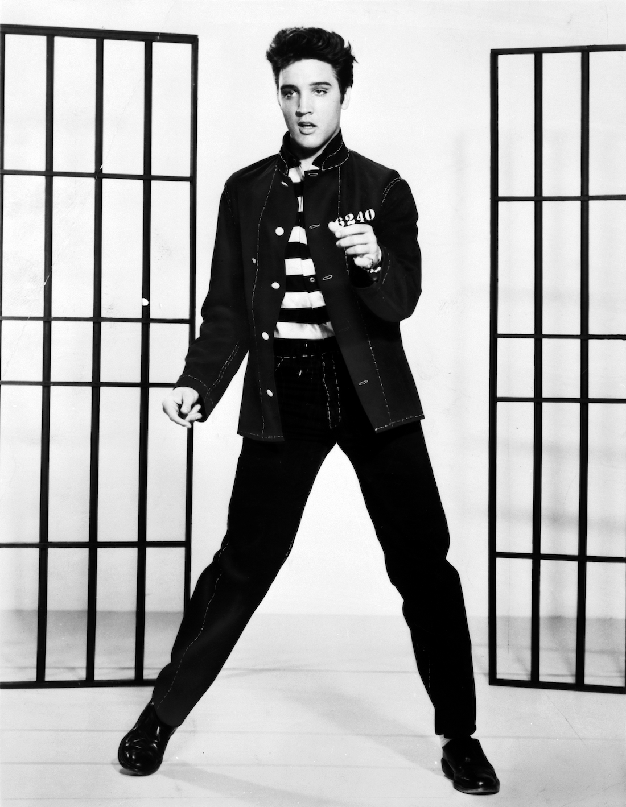
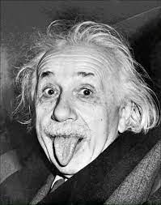

# EG12
Disponível a partir de: quinta, 30 set 2021, 10:00
Data de entrega: quinta, 30 set 2021, 13:00
Arquivos requeridos: npimagem.py ( Baixar)
Tipo de trabalho: Trabalho individual
## Exercício em time: EG da aula 12 - classe NPImagem

Não se esqueça de preencher o Formulário Individual
Procurem ler as instruções para as atividades específicas em grupo


## Preparação para a atividade em time

As instruções gerais para as atividades em grupo estão aqui.

Basicamente você deve:
- voltar para a sala principal caso você esteja sozinhE.
- fazer uma cópia do seu EI, colocando o prefixo eg_. Assim, se o nome do arquivo EI for exercicio.py, o nome do arquivo a ser entregue será eg_exercicio.py. Vamos chamar esse arquivo de EG.
- sortear a pessoa “estagiária” e a pessoa “gerente” conforme as instruções.
- preencher o formulário individual conforme as instruções.


## Atividades específicas

A partir daqui sugerimos que o gerente leia as instruções em voz alta para que todos possam acompanhar a leitura e colaborar para o seu entendimento.
Roteiro para realizar esse exercício

Para que a leitura não se torne cansativa, procure ler apenas um item por vez e reuna o time para realizar a atividade referente ao item, antes de passar ao próximo item.

1. Teste os métodos da classe NPImagem
    - init(): verifique se contem um atributo data do tipo numpy.ndarray.
    - str()
    - getitem()
    - setitem()
    - crop()

    da classe NPImagem usando uma (nova?) função main() no mesmo arquivo npimagem.py.
    Lembrem-se que a pessoa estagiária deve colocar os testes na main() e compartilhar esse EG com os demais membros do time para que todos possam testar os seus trabalhos individuais.
    Inclua o comando if __name__ == '__main__': para chamar a função main() como ilustrado no último exercício em time. 

2. Correção e testes individuais
    - Cada pessoa do time deve verificar, com a ajuda de seus colegas quando necessário, se seu programa EI/EG está dentro da especificação. Não hesite em pedir ajuda a seu time em caso de dificuldade.
    - Cada pessoa do time deve testar sua classe usando a função main() com todos os testes e executar os testes e verificar se a classe passa em todos os testes.
    - Caso algum problema seja encontrado, discuta como resolvê-los com seus colegas de time.

3. Desafio 1: Escreva mais esse método na classe NPImagem:
    ```
    def pinte_retangulo(self, sup, esq, inf, dir, v=0):
        ''' (NPImagem, int, int, int, int, int) -> None 
        Recebe 4 inteiros que definem o canto superior-esquerdo (sup, esq) e
        o canto inferior-direito (inf,dir) de uma região retangular com 
        relação a posição (0,0) de self, ou seja, os cantos são "deslocamentos" 
        em pixeis com relação à origem.
        Esse método pinta, com o valor v, os pixeis de self que tenham sobreposição com o retângulo (sup,esq)x(inf,dir). 
        '''
    ``` 
    Exemplo: o trecho de código a seguir:

    ```
    lista = list(range(30))
    ar = np.array(lista).reshape(5,6)
    img1 = NPImagem( (0, 0), ar)  # 
    print(f"img1:\n{img1}")
    print(f"Shape de img1: {img1.shape}\n")

    img2 = NPImagem( (3, 2), 100)
    img3 = img2.crop() ## cria uma cópia
    img2[2,1] = -10
    print(f"img2[1,2]={img2[2,1]}")
    print(f"img2:\n{img2}\n")
    print(f"img3:\n{img3}\n")

    img1.pinte_retangulo(1,2,3,5,99)
    print(f"img1.pinte_retangulo(1,2,3,5,99):\n{img1}\n")

    img2.pinte_retangulo(-1,-2,1,2,88)
    print(f"img2.pinte_retangulo(-1,-2,1,2,88):\n{img2}\n")

    img3.pinte_retangulo(1,0,3,4,77)
    print(f"img3.pinte_retangulo(1,0,3,4,77):\n{img3}\n")
    ```

    deve resultar na saída (dos prints):

    ```
    img1:
    [[ 0  1  2  3  4  5]
     [ 6  7  8  9 10 11]
     [12 13 14 15 16 17]
     [18 19 20 21 22 23]
     [24 25 26 27 28 29]]
    Shape de img1: (5, 6)

    img2[1,2]=-10
    img2:
     [[100 100]
     [100 100]
     [100 -10]]

    img3:
    [[100 100]
     [100 100]
     [100 100]]

    img1.pinte_retangulo(1,2,3,5,99):
    [[ 0  1  2  3  4  5]
     [ 6  7 99 99 99 11]
     [12 13 99 99 99 17]
     [18 19 20 21 22 23]
     [24 25 26 27 28 29]]

    img2.pinte_retangulo(-1,-2,1,2,88):
    [[ 88  88]
     [ 88  88]
     [100 -10]]

    img3.pinte_retangulo(1,0,3,4,77):
    [[100 100]
     [ 77  77]
     [ 77  77]]
    ```
4. Desafio 2: Escreva mais esse método

    ```
    def paste(self, other, sup, esq):
        '''(NPImagem, NPImagem, int, int) -> None
        Recebe um objeto NPImagem other e par de inteiros (sup, esq) 
        que indica um deslocamento em relação à origem de self (posição (0,0)) 
        onde a NPImagem other deve ser sobreposta sobre self. Observe que
        esse deslocamento pode ser negativo.
        ''' 
    ```
    
    Exemplo: considere a continuação do trecho de código com as NPImagens img1, img2, img3 anteriores:

    ```
    img1.paste(img2, 1, 2)
    print(f"img1.paste(img2,1,2):\n{img1}\n")

    img1.paste(img3, 3, 5)
    print(f"img1.paste(img3,3,5):\n{img1}\n")

    img1.paste(img3, -1, -1)
    print(f"img1.paste(img3,-1,-1):\n{img1}\n")
    ```

    deve resultar na saída (dos prints):
    
    ```
    img1.paste(img2,1,2):
    [[  0   1   2   3   4   5]
     [  6   7  88  88  99  11]
     [ 12  13  88  88  99  17]
     [ 18  19 100 -10  22  23]
     [ 24  25  26  27  28  29]]

    img1.paste(img3,3,5):
    [[  0   1   2   3   4   5]
     [  6   7  88  88  99  11]
     [ 12  13  88  88  99  17]
     [ 18  19 100 -10  22 100]
     [ 24  25  26  27  28  77]]

    img1.paste(img3,-1,-1):
    [[ 77   1   2   3   4   5]
     [ 77   7  88  88  99  11]
     [ 12  13  88  88  99  17]
     [ 18  19 100 -10  22 100]
     [ 24  25  26  27  28  77]]
    ```

5. Parte opcional: experimento usando imagens de verdade

Faça o download dessas imagens na mesma pasta onde se encontra o arquivo npimagem.py para usá-las como exemplo:

- elvis.png
  

- einstein.png
  

e utilize os métodos pinte_retangulo, crop() e paste() para compor um imagem como essa:
- composicao.png


Para carregar e exibir uma imagem podemos usar o módulo Matplotlib do Python. Esse é um outro módulo bastante utilizado em computação científica para a exibição de gráficos.

Para carregar e exibir imagens usando Matplotlib use o seguinte trecho de código:

```
import numpy as np
import matplotlib.pyplot as plt
import matplotlib.image as mpimg

from npimagem import NPImagem

import numpy as np
import matplotlib.pyplot as plt
import matplotlib.image as mpimg

from npimagem import NPImagem

def main():
    fname = 'elvis.png'
    image = mpimg.imread(fname)
    gray = np.array(image)[:,:,2] ## pega canal G da imagem RGB

    elvis = NPImagem( (), gray ) # transforma o array em uma NPImagem
    print("elvis.shape: ", elvis.shape)
    plt.gray()
    plt.imshow(elvis.data)
    plt.show()

    fname = 'einstein.png'
    image = mpimg.imread(fname)
    gray = np.array(image)[:,:,2] ## pega canal G da imagem RGB

    einstein = NPImagem( (), gray)
    print("einstein.shape", einstein.shape)

    plt.imshow(einstein.data)
    plt.show()

main()
```

Nesse exemplo, você deve “fechar” a janela que exibe uma imagem para abrir a próxima. Modifique (estenda) esse programa para produzir o efeito desejado.

## O que você deve entregar para conseguir um bônus

Para entregar o EG não é necessário modificar o cabeçalho do seu EI (exercício individual), ou seja, use o mesmo cabeçalho e faça as modificações que desejar no código do EI, seguindo ou não as discussões do time. Lembre-se de incluir o prefixo eg_ no nome do arquivo e de manter o formato .py para enviar seu EG com os novos métodos pinte_retangulo() e paste().

Você só precisa entregar o arquivo com extensão eg_ contendo os novos métodos e/ou funções implementados, inclusive a main() utilizada para testes.

Você também precisa responder o formulário individual cujo link foi fornecido durante a aula caso deseje concorrer ao bônus de ter participado do exercício em grupo.

Lembre-se de testar a solução antes de entregá-la e conferir suas respostas. O bônus recebido será 10% da nota do seu EG.

Não serão aceitos EGs após encerrado o prazo de entrega.

## Arquivos requeridos
#### npimagem.py
```
# -*- coding: utf-8 -*-

#------------------------------------------------------------------
# LEIA E PREENCHA O CABEÇALHO 
#------------------------------------------------------------------

'''

    Nome:
    NUSP:

    Ao preencher esse cabeçalho com o meu nome e o meu número USP,
    declaro que todas as partes originais desse exercício programa
    foram desenvolvidas e implementadas por mim e que, portanto, não 
    constituem desonestidade acadêmica ou plágio.
    
    Entendo que trabalhos sem assinatura devem receber nota zero e, ainda
    assim, poderão ser punidos por desonestidade acadêmica.
    Declaro também que sou responsável por todas as cópias desse
    programa e que não distribui ou facilitei a sua distribuição.
    
    Estou ciente que os casos de plágio e desonestidade acadêmica
    estarão sujeitos às penalidades descritas na página da disciplina
    na seção "Sobre colaboração em MAC0122".

    Reconheço que utilizei as seguintes fontes externas ao conteúdo 
    utilizado e recomendado em MAC0122, ou recebi auxílio das pessoas
    listadas abaixo.

    - LISTA de fontes externas utilizadas (links ou referências como livros)
        - 

    - LISTA das pessoas que me auxiliaram a fazer esse trabalho
        - 
'''

## ==================================================================


import numpy as np

## ------------------------------------------------------------------
def main():

    print("Testes da classe NPImagem\n")

## ------------------------------------------------------------------
class NPImagem():

    # escreva aqui os métodos da classe NPImagem
## ------------------------------------------------------------------
## ------------------------------------------------------------------
if __name__ == '__main__':
    main()
```