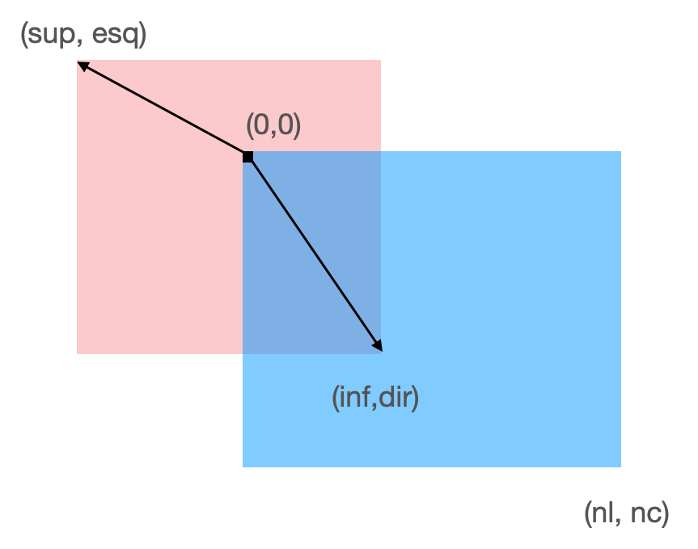

# EI13
Data de entrega: segunda, 4 out 2021, 22:00
Arquivos requeridos: npimagem.py ( Baixar)
Tipo de trabalho: Trabalho individual

## Classe NPImagem

Nesse exercício vamos estender a classe NPImagem com mais alguns métodos para investigar o ganho de desempenho oferecido pelo uso de arrays.

A classe NPImagem utiliza um ndarray para representar imagens. Em termos ‘geométricos’, podemos imaginar que uma NPImagem img é como um retângulo, com canto superior esquerdo na origem (0,0) e canto inferior-direito em na coordenada img.shape=(nl,nc), onde nl indica o número de linha e nc o número de colunas da imagem. Considere essa imagem como o retângulo azul na figura abaixo.

Um outro retângulo pode ser descrito por dois cantos, como o canto superior-esquerdo (sup, esq) e seu canto inferior-direito (inf, dir), onde sup, esq, inf e dir. Para relacionar esse com outros retângulos, podemos entender esses cantos como “deslocamentos” com relação à origem de outro retângulo, como mostra a figura abaixo.
<br>Sobreposição.

Observe que os deslocamentos podem ser “negativos” com relação à origem (0,0), o que não significa que esses valores negativos correspondam a índices negativos do ndarray. No entanto, como esses deslocamentos foram bastante confundidos com índices de fatias e também devido a um problema com um dos exemplos no último exercício, nesse exercício vamos reescrever os métodos **pinte_retangulo()** e **paste()** (ou escrevê-los pela 1ª vez), além de estender a classe com os operadores de soma e multiplicação.
Esses exercícios também foram tratados na última atividade de revisão.

## Leituras preliminares

- Tipos de dados abstratos - Arrays

- O que é uma imagens digital
    - Por simplicidade, vamos trabalhar com imagens com tons de cinza, onde cada tom é representado por um inteiro. As funções para ler, gravar e mostrar imagens na tela serão fornecidas posteriormente. Nesse exercício vamos começar a entender como manipular as matrizes (arrays) que representam as imagens.
- AR12

## O que você deve fazer

Estenda a classe NPImagem com os seguintes métodos:

-   método pinte_retângulo:
```
    def pinte_retangulo(self, sup, esq, inf, dir, v=0):
        ''' (NPImagem, int, int, int, int, int) -> None 
        Recebe 4 inteiros que definem o canto superior-esquerdo (sup, esq) e
        o canto inferior-direito (inf,dir) de uma região retangular com 
        relação a posição (0,0) de self, ou seja, os cantos são "deslocamentos" 
        em pixeis com relação à origem.
        Esse método pinta, com o valor v, os pixeis de self que tenham sobreposição com o retângulo (sup,esq)x(inf,dir). 
        '''
```
- método paste():
```
     def paste(self, other, sup, esq):
         '''(NPImagem, NPImagem, int, int) -> None
         Recebe um objeto NPImagem other e um par de inteiros (sup, esq) 
         que indica um deslocamento em relação à origem de self (posição (0,0)) 
         onde a NPImagem other deve ser sobreposta sobre self. Observe que
         esse deslocamento pode ser negativo. Nesse caso, a dimensão de other
         define o canto inferior-direito do retângulo.
         ''' 
```

- método especial add
```
    def __add__(self, other):
        ''' (NPImagem, NPImagem) -> NPImagem
        Recebe dois objetos NPImagem e retorna a soma, elemento-a-elemento,
        dos pixels de self e other.
        '''
```
- método especial mul
```
    def __mul__(self, other):
        ''' (NPImagem, NPImagem) -> NPImagem
        Recebe dois objetos NPImagem e retorna o produto, elemento-a-elemento,
        dos pixels de self e other.
        '''
```

## DICAS

Não faça nada do zero. Utilize o que você já implementou nos exercícios anteriores e apenas faça as modificações necessárias na classe NPImagem.

### Exemplo

Estude os exemplos a seguir para compreender o comportamento esperado desses métodos.
```
    print("======Teste operadores\n")

    imgA = NPImagem( (2,3), 5)
    imgB = NPImagem( (), np.arange(20).reshape(5,4) )
    imgC = imgB.crop(2,1,4,4)
    imgD = imgA + imgC
    print(f"imgA:\n{imgA}")
    print(f"imgB:\n{imgB}")
    print(f"imgC:\n{imgC}")
    print(f"imgD:\n{imgD}")

    print("\n===== Crop ========\n")

    lista = list(range(30))
    ar = np.array(lista).reshape(6,5)
    img1 = NPImagem( (0, 0), ar)  # 
    print(f"img1:\n{img1}")
    print(f"Shape de img1: {img1.shape}\n")

    img2 = NPImagem( (4, 3), 88)
    img3 = img2.crop() ## cria uma cópia
    img2[2,1] = -10
    print(f"img2[2,1]={img2[2,1]}")
    print(f"img2:\n{img2}\n")
    print(f"img3:\n{img3}\n")

    print("======Teste pinte_retangulo\n")
    img1.pinte_retangulo(1,2,3,5,77)
    print(f"img1.pinte_retangulo(1,2,3,5,99):\n{img1}\n")

    img2.pinte_retangulo(-1,-2,2,3,99)
    print(f"img2.pinte_retangulo(-1,-2,1,2,88):\n{img2}\n")

    img3.pinte_retangulo(1,0,3,4,66)
    print(f"img3.pinte_retangulo(1,0,3,4,77):\n{img3}\n")

    print("======Teste paste\n")
    img1 = NPImagem( (0, 0), ar)  # 
    img2 = NPImagem( (2, 3), 99)
    img3 = img1.crop(2,1,5,3) ## cria uma cópia
    print(f"img1:\n{img1}")
    print(f"img2:\n{img2}")
    print(f"img3:\n{img3}")

    img1.paste(img2, 2, 3)
    print(f"img1.paste(img2,2,3):\n{img1}\n")

    img1.paste(img3, 4, 2 )
    print(f"img1.paste(img3,4,2):\n{img1}\n")

    img1.paste(img3, -1, 2)
    print(f"img1.paste(img3,-1,2):\n{img1}\n")
```
O resultado deve ser:
```
======Teste operadores

imgA:
[[5 5 5]
 [5 5 5]]
imgB:
[[ 0  1  2  3]
 [ 4  5  6  7]
 [ 8  9 10 11]
 [12 13 14 15]
 [16 17 18 19]]
imgC:
[[ 9 10 11]
 [13 14 15]]
imgD:
[[14 15 16]
 [18 19 20]]

===== Crop ========

img1:
[[ 0  1  2  3  4]
 [ 5  6  7  8  9]
 [10 11 12 13 14]
 [15 16 17 18 19]
 [20 21 22 23 24]
 [25 26 27 28 29]]
Shape de img1: (6, 5)

img2[2,1]=-10
img2:
[[ 88  88  88]
 [ 88  88  88]
 [ 88 -10  88]
 [ 88  88  88]]

img3:
[[88 88 88]
 [88 88 88]
 [88 88 88]
 [88 88 88]]

======Teste pinte_retangulo

img1.pinte_retangulo(1,2,3,5,99):
[[ 0  1  2  3  4]
 [ 5  6 77 77 77]
 [10 11 77 77 77]
 [15 16 17 18 19]
 [20 21 22 23 24]
 [25 26 27 28 29]]

img2.pinte_retangulo(-1,-2,1,2,88):
[[ 99  99  99]
 [ 99  99  99]
 [ 88 -10  88]
 [ 88  88  88]]

img3.pinte_retangulo(1,0,3,4,77):
[[88 88 88]
 [66 66 66]
 [66 66 66]
 [88 88 88]]

======Teste paste

img1:
[[ 0  1  2  3  4]
 [ 5  6  7  8  9]
 [10 11 12 13 14]
 [15 16 17 18 19]
 [20 21 22 23 24]
 [25 26 27 28 29]]
img2:
[[99 99 99]
 [99 99 99]]
img3:
[[11 12]
 [16 17]
 [21 22]]
img1.paste(img2,2,3):
[[ 0  1  2  3  4]
 [ 5  6  7  8  9]
 [10 11 12 99 99]
 [15 16 17 99 99]
 [20 21 22 23 24]
 [25 26 27 28 29]]

img1.paste(img3,4,2):
[[ 0  1  2  3  4]
 [ 5  6  7  8  9]
 [10 11 12 99 99]
 [15 16 17 99 99]
 [20 21 11 12 24]
 [25 26 16 17 29]]

img1.paste(img3,-1,2):
[[ 0  1 16 17  4]
 [ 5  6 21 22  9]
 [10 11 12 99 99]
 [15 16 17 99 99]
 [20 21 11 12 24]
 [25 26 16 17 29]]
```

## Roteiro

Leia o(s) texto(s) sugeridos na seção Estudo premilinar.

- Baixe o arquivo npimagem.py para uma pasta do seu computador ou use seu arquivo anterior e complete com os novos métodos.
- Carregue esse arquivo usando o Spyder ou Colab.
- Leia o cabeçalho do arquivo com atenção e edite o cabeçalho colocando seu nome e NUSP.
- Estude o enunciado e os exemplos fornecidos para entender o que você deve implementar.
- Implemente, documente e teste seu trabalho.
- Caso você deseje testar sua classe no próprio arquivo, não se esqueça de incluir o “if _ _ name  _ …” no final do arquivo.
- Submeta apenas o arquivo npimagem.py.

## Honestidade acadêmica

Esse é um exercício individual, não em grupo. Isso não significa que você não pode receber ajuda de outras pessoas, inclusive de seus colegas. De uma forma geral, gostaríamos de incentivar as discussões de ideias, conceitos e alternativas de solução. Nossa maior recomendação é evitar olhar o código fonte de uma solução antes de escrever o seu programa. Em caso de dúvida, consulte a página Sobre colaboração em MAC0122

De forma sucinta, evite as seguintes ações que caracterizam desonestidade acadêmica na realização dos trabalhos individuais desse curso:

- buscar e obter uma solução (parcial ou completa, correta ou não) de exercício programa (EP) na internet ou qualquer outro meio físico ou virtual, durante o período de submissão do referido EP;
- solicitar ou obter uma cópia (parcial ou completa, correta ou não) da solução de um EP durante o seu período de submissão;
- permitir que um colega acesse uma cópia (parcial ou completa, correta ou não) do seu EP, durante o período de submissão;
- ainda mais grave é o plágio, que se configura pela utilização de qualquer material não visto em aula ou não descrito no enunciado, que não seja de sua autoria, em parte ou ao todo, e entregar, com ou sem edição, como se fosse seu trabalho, para ser avaliado.

## Arquivos requeridos
#### npimagem.py
```
# -*- coding: utf-8 -*-

#------------------------------------------------------------------
# LEIA E PREENCHA O CABEÇALHO 
#------------------------------------------------------------------

'''

    Nome:
    NUSP:

    Ao preencher esse cabeçalho com o meu nome e o meu número USP,
    declaro que todas as partes originais desse exercício programa
    foram desenvolvidas e implementadas por mim e que, portanto, não 
    constituem desonestidade acadêmica ou plágio.
    
    Entendo que trabalhos sem assinatura devem receber nota zero e, ainda
    assim, poderão ser punidos por desonestidade acadêmica.
    Declaro também que sou responsável por todas as cópias desse
    programa e que não distribui ou facilitei a sua distribuição.
    
    Estou ciente que os casos de plágio e desonestidade acadêmica
    estarão sujeitos às penalidades descritas na página da disciplina
    na seção "Sobre colaboração em MAC0122".

    Reconheço que utilizei as seguintes fontes externas ao conteúdo 
    utilizado e recomendado em MAC0122, ou recebi auxílio das pessoas
    listadas abaixo.

    - LISTA de fontes externas utilizadas (links ou referências como livros)
        - 

    - LISTA das pessoas que me auxiliaram a fazer esse trabalho
        - 
'''

## ==================================================================


import numpy as np

## ------------------------------------------------------------------
def main():

    print("Testes da classe NPImagem\n")

## ------------------------------------------------------------------
class NPImagem():

    # escreva aqui os métodos da classe NPImagem
## ------------------------------------------------------------------
## ------------------------------------------------------------------
if __name__ == '__main__':
    main()
```