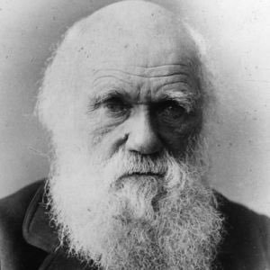
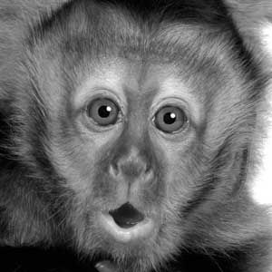
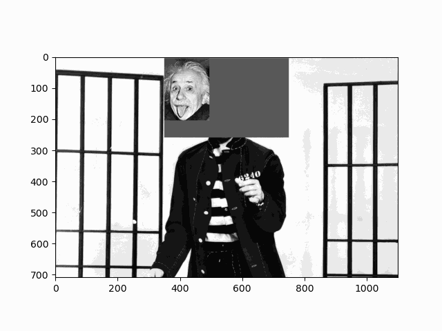
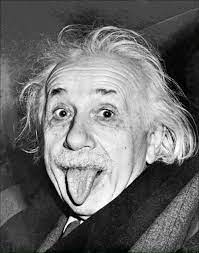
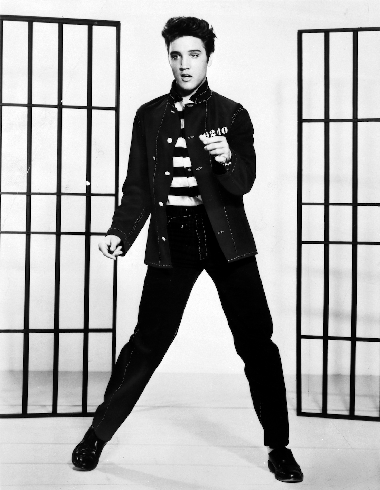

# EG13
Data de entrega: quinta, 7 out 2021, 12:30
Arquivos requeridos: eg_npimagem.py ( Baixar)
Tipo de trabalho: Trabalho individual

## Exercício em time: EG da aula 13 - mais operações com imagens do tipo NPImagem

Não se esqueça de preencher o [Formulário Individual](https://docs.google.com/forms/d/e/1FAIpQLSfdcNlI2GH0NaeurpdtVRok6IpAgIdBpCv89h3UsTcveUZbfA/alreadyresponded)

Procurem ler as instruções para as atividades específicas em grupo

## Preparação para a atividade em time

As instruções gerais para as atividades em grupo estão aqui.

Basicamente você deve:

- voltar para a sala principal caso você esteja sozinhE.
- fazer uma cópia do seu EI, colocando o prefixo eg_. Assim, se o nome do arquivo EI for exercicio.py, o nome do arquivo a ser entregue será eg_exercicio.py. Vamos chamar esse arquivo de EG.
- sortear a pessoa “estagiária” e a pessoa “gerente” conforme as instruções.
- preencher o formulário individual conforme as instruções.

## Atividades específicas

A partir daqui sugerimos que o gerente leia as instruções em voz alta para que todos possam acompanhar a leitura e colaborar para o seu entendimento.


## Roteiro para realizar esse exercício

Para que a leitura não se torne cansativa, procure ler apenas um item por vez e reuna o time para realizar a atividade referente ao item, antes de passar ao próximo item.

0. Teste os métodos da classe NPImagem do EI12 (pois serão usados no experimento)
    - __ init __(): verifique se contem um atributo data do tipo numpy.ndarray.
    - __ str __()
    - __ getitem __()
    - __ setitem __()
    - crop(): que deve retornar uma NPImagem

    da classe NPImagem usando uma (nova?) função main() no mesmo arquivo npimagem.py.

1. Assim a gente pode ter mais confiança caso algum método do EI13 não funcione. Teste agora os novos métodos:

    - __ add \_\_(self, other): Para esse exercício, adotem a seguinte solução, completando as lacunas. Recomendamos usar algo semelhante para o método \_\_mul__.
    
        ```
        def __add__(self, other):
            ''' (NPImagem, NPImagem) -> NPImagem
            Recebe dois objetos NPImagem e retorna a soma, elemento-a-elemento,
            dos pixels de self e other.
            '''
            if type(other) is int or type(other) is float:
                data = self.data + ## LACUNA
            else:
                data = self.data + ## LACUNA
            return    ## LACUNA
        ```
        
    Observe que essa solução soma objetos array explicitamente, ao invés de somar cada elemento (lin, col) da matriz, elemento-a-elemento. Chamaremos de vetorização essas operações realizadas diretamente com arrays ao invés de por-elemento.

    - __ mul __()
    - modifique seu método \__mul\_\_() para que seja também vetorizado e possa ser usado com os tipos int e float, semelhante ao comportamento de \__add\_\_() acima.
    - pinte_retangulo()
    - paste()

    Lembrem-se que a pessoa estagiária deve colocar os testes na main() e compartilhar esse EG com os demais membros do time para que todos possam testar os seus trabalhos individuais.

    Inclua o comando if __name\_\_ == '__main\_\_': para chamar a função main() como ilustrado no último exercício em time.

2. Correção e testes individuais
    - Cada pessoa do time deve verificar, com a ajuda de seus colegas quando necessário, se seu programa EI/EG está dentro da especificação. Não hesite em pedir ajuda a seu time em caso de dificuldade.
    - Cada pessoa do time deve testar sua classe usando a função main() com todos os testes e executar os testes e verificar se a classe passa em todos os testes.
    - Caso algum problema seja encontrado, discuta como resolvê-los com seus colegas de time.

3. Desafio 1: Escreva mais esse método na classe NPImagem:

    ```
    def blend(self, other, alfa=0.5):
        ''' (NPImagem, NPImagem, float) -> NPImagem
        Recebe duas NPImagens e retorna uma nova NPImagem que mistura essas 
        imagens com peso alfa e (1-alfa) tal que o resultado seja:
        self * alfa + other * (1-alfa)
        '''
    ```

    Exemplo: o trecho de código a seguir:

    ```
    img1 = NPImagem( (3,5), 10.0 )
    img2 = NPImagem( (3,5), 20.0 )
    img3 = img1.blend(img2, 0.10)
    print(img3)
    ```
    deve resultar na saída (do print):

    ```
    [[19. 19. 19. 19. 19.]
     [19. 19. 19. 19. 19.]
     [19. 19. 19. 19. 19.]]
    ```

4. Desafio 2: Inclua em sua classe NPImagem o método add_iterativo() como definido a seguir:

    ```
    def add_iterativo(self, other):
        ''' (NPImagem, NPImagem) -> NPImagem
        '''
        nl, nc = self.shape
        res = NPImagem( self.shape, 0.0 )
        if type(other) is int or type(other) is float:
            for lin in range(nl):
                for col in range(nc):
                    res[lin,col] = self[lin,col] + other
        else:
            for lin in range(nl):
                for col in range(nc):
                    res[lin,col] = self[lin,col] + other[lin,col]
        return res
    ```
    Observe que essa solução acessa cada elemento (lin,col) e portanto não usa vetorização. Utilizando esse método add_iterativo(), escreva o método blend_iterativo() que usa, obrigatoriamente, o método add_iterativo para misturar duas imagens.

    ```
    def blend_iterativo(self, other, alfa=0.5):
        ''' (NPImagem, NPImagem, float) -> NPImagem
        Recebe duas NPImagens e retorna uma nova NPImagem que mistura essas imagens com peso self * alfa + other * (1-alfa). 
        A soma deve ser realizada usando o método add_iterativo.
        '''
    ```

    O comportamento desse método deve ser o mesmo que o do método blend(). O objetivo é comparar o desempenho entre essas duas implementações no experimento do próximo item. Teste seus métodos antes de continuar.

5. Experimento:

    Um vídeo pode ser considerado como uma sequência de imagens. Observe o vídeo abaixo:
    

    Blend que foi criado usando essas imagens:
     e <br>

    e o método blend (iterativo e/ou vetorizado). Baixe essas duas imagens no seu computador na mesma pasta do seu programa (clique nelas com o botão direito do mouse para salvá-las no seu computador).

    A seguir, crie um arquivo experimento.py também na mesma pasta que seu programa npimagem.py e copie esse código do experimento. Estude e complete as LACUNAS desse trecho para criar uma lista de imagens onde darwin.png se transforma em monkey.png, semelhante ao vídeo acima. Experimente vários valores de n (LACUNA 1), que corresponde ao número de imagens no vídeo. Ao final, preencha o formulário com o valor da razão dos tempos entre os métodos iterativo e vetorizado.

    **Discussão**: Qual dos métodos é mais eficiente: o iterativo ou o vetorizado? Como tudo foi feito em Python, discuta com seu time o motivo da diferença.

6. Divertimento:

    O arquivo experimento.py traz algumas funções interessantes, como a mostre_animacao() e salve_animacao(). Usando essas funções e os recursos da classe NPImagem como pinte_retangulo, crop e paste, use sua imaginação para criar vídeos como abaixo e envie suas obras para nosso servidor no Discord.

    Exemplo:
    
    Sem cabeça

    que foi criado usando essas imagens:
     e 

## O que você deve entregar para conseguir um bônus

Para entregar o EG não é necessário modificar o cabeçalho do seu EI (exercício individual), ou seja, use o mesmo cabeçalho e faça as modificações que desejar no código do EI, seguindo ou não as discussões do time. Lembre-se de incluir o prefixo eg_ no nome do arquivo e de manter o formato .py para enviar seu EG com os novos métodos.
   - Você só precisa entregar o arquivo com extensão eg_ contendo os novos métodos e/ou funções implementados, inclusive a main() utilizada para testes.
   - Você também precisa responder o formulário individual cujo link foi fornecido durante a aula caso deseje concorrer ao bônus de ter participado do exercício em grupo.
   - Lembre-se de testar a solução antes de entregá-la e conferir suas respostas. O bônus recebido será 10% da nota do seu EG.

Não serão aceitos EGs após encerrado o prazo de entrega.


### Arquivos requeridos
#### eg_npimagem.py

```
# -*- coding: utf-8 -*-

#------------------------------------------------------------------
# LEIA E PREENCHA O CABEÇALHO 
#------------------------------------------------------------------

'''

    Nome:
    NUSP:

    Ao preencher esse cabeçalho com o meu nome e o meu número USP,
    declaro que todas as partes originais desse exercício programa
    foram desenvolvidas e implementadas por mim e que, portanto, não 
    constituem desonestidade acadêmica ou plágio.
    
    Entendo que trabalhos sem assinatura devem receber nota zero e, ainda
    assim, poderão ser punidos por desonestidade acadêmica.
    Declaro também que sou responsável por todas as cópias desse
    programa e que não distribui ou facilitei a sua distribuição.
    
    Estou ciente que os casos de plágio e desonestidade acadêmica
    estarão sujeitos às penalidades descritas na página da disciplina
    na seção "Sobre colaboração em MAC0122".

    Reconheço que utilizei as seguintes fontes externas ao conteúdo 
    utilizado e recomendado em MAC0122, ou recebi auxílio das pessoas
    listadas abaixo.

    - LISTA de fontes externas utilizadas (links ou referências como livros)
        - 

    - LISTA das pessoas que me auxiliaram a fazer esse trabalho
        - 
'''

## ==================================================================


import numpy as np

## ------------------------------------------------------------------
def main():

    print("Testes da classe NPImagem\n")

## ------------------------------------------------------------------
class NPImagem():

    # escreva aqui os métodos da classe NPImagem
## ------------------------------------------------------------------
## ------------------------------------------------------------------
if __name__ == '__main__':
    main()
```

---

#### experimento.py

```
'''
Experimento EG13

Qual a relação de desempenho entre as versões 
iterativa e vetorizada do método blend?

Para responder essa pergunta:

1) copie o código do experimento para um arquivo "experimento.py"
no mesmo diretório de seu eg_npimagem.py
2) baixe as imagens darwin.png e monkey.png no mesmo diretório.

Abra o arquivo experimento.py no Colab, Spyder ou IDE de
sua preferência. Antes de executar, leia o código e complete 
as lacunas com valores apropriados para gerar uma sequência 
de imagens (vídeo) semelhante ao exemplo do enunciado.

'''
import numpy as np
import matplotlib.pyplot as plt
import matplotlib.image as mpimg
import matplotlib.animation as animation

from timeit import default_timer as timer

from eg_npimagem import NPImagem

def main():
    darwin = load_image('darwin.png')
    monkey = load_image('monkey.png')

    n =             ## LACUNA 1 --->  use diferentes valores de n
    video_v = [None]*(n*2)

    start = timer()
    for i in range(n):  
        ALFA =      ## LACUNA 2 ---> qual o valor de alfa para criar o efeito 
        img = darwin.blend(monkey, ALFA)
        video_v[i] = video_v[2*n-1-i] = img
    end = timer()

    difv = end-start
    print(f"tempo médio para calcular {n} blend vetorizado: {difv/n}")

    start = timer()
    video_i = [None]*(n*2)
    for i in range(n):  
        ALFA =      ## LACUNA 3 ---> qual o valor de alfa para criar o efeito 
        img = darwin.blend_iterativo(monkey, ALFA)
        video_i[i] = video_i[2*n-1-i] = img
    end = timer()
    difi = end-start
    print(f"tempo médio para calcular {n} blend iterativo: {difi/n}")

    print("\n+++++")
    print(f"razão tempo iterativo / vetorizado: {difi/difv}")

    print("\n+++++")
    print("Video criado por blend vetorizado")
    print("Feche a janela do vídeo para continuar ...")
    mostre_animacao(video_v)

    print("\n+++++")
    print("Video criado por blend iterativo")
    print("Feche a janela do vídeo para continuar ...")
    mostre_animacao(video_i)

    salve_animacao(video_i)

# ========================================================================
def load_image( fname, show = False ):
    ''' (str, bool) -> NPImagem
    Recebe o nome fname de um arquivo e carrega e retorna
    a NPImagem correspondente.

    '''
    image = mpimg.imread(fname)
    gray = np.array(image)[:,:,2] ## pega canal G da imagem RGB

    npi = NPImagem( (), gray )
    if show:
        print("Carreguei uma image com shape: ", npi.shape)
        print("Feche a janela para continuar...")
        plt.gray()
        plt.imshow(npi.data)
        plt.show()

    return npi

# ========================================================================
def converta( npimagens ):
    ''' (list) -> list
    recebe uma lista de objetos NPImagem e retorna uma lista de arrays
    do Numpy prontas para serem animadas.
    A função acessa o atributo data
    '''
    npimgs = []
    for pym in npimagens:
        npimgs.append( [plt.imshow( np.array( pym.data ), cmap='gray', animated=True)] )
    return npimgs

# ========================================================================
def mostre_animacao( npimagens = [], interval=50, blit=True, repeat_delay=1000 ):
    ''' (list) -> None
    Recebe uma lista npimagens de objetos do tipo NPImagem
    e cria e mostra uma animação dessas npimagens.
    '''
    fig = plt.figure()
    npimgs = converta( npimagens )
    ani = animation.ArtistAnimation(fig, npimgs, interval, blit, repeat_delay)
    plt.show()

# ========================================================================
def salve_animacao( pymagens = [], interval=50, blit=True, repeat_delay=1000 ):
    ''' (list) -> None
    Recebe uma lista de NPImagens 
    e cria e salva uma animação dessas NPImagens no arquivo "animation.gif".
    '''
    fig = plt.figure()
    npimgs = converta( pymagens )
    ani = animation.ArtistAnimation(fig, npimgs, interval, blit, repeat_delay)
    
    writer = animation.PillowWriter(fps=15)
    ani.save( 'animation.gif', writer=writer )

# ========================================================================

if __name__ == '__main__':
    main()

```
