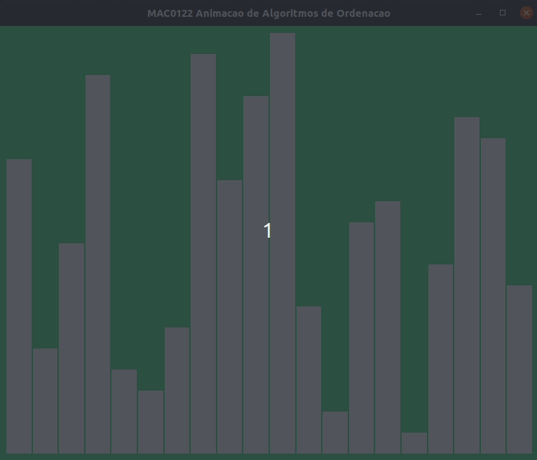
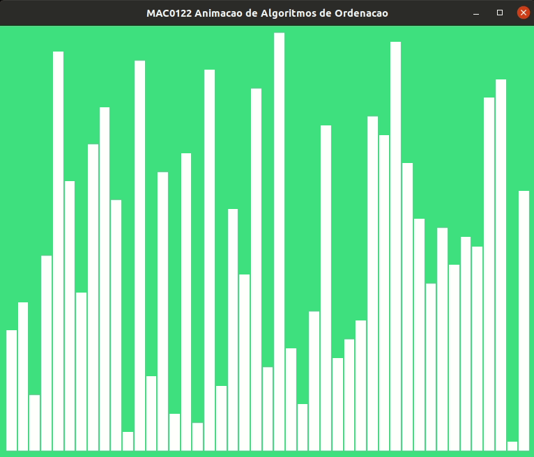
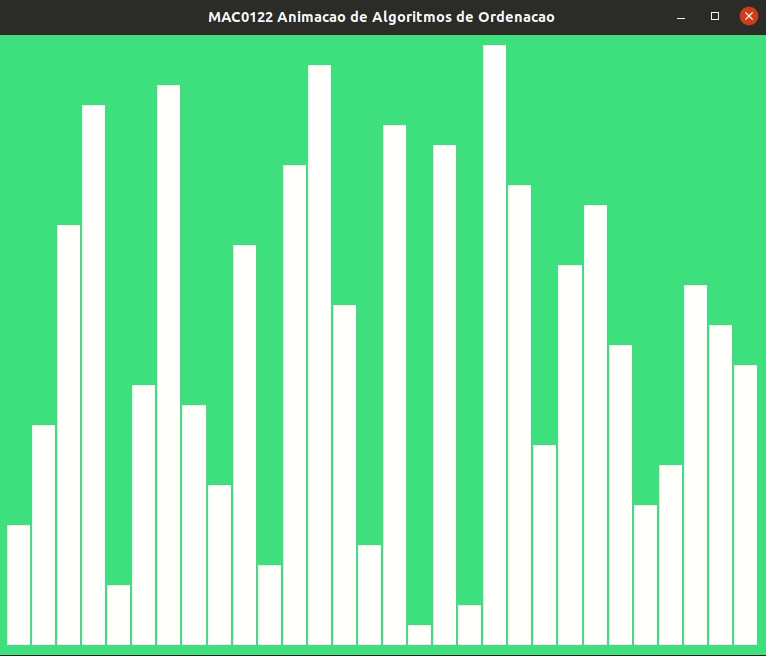
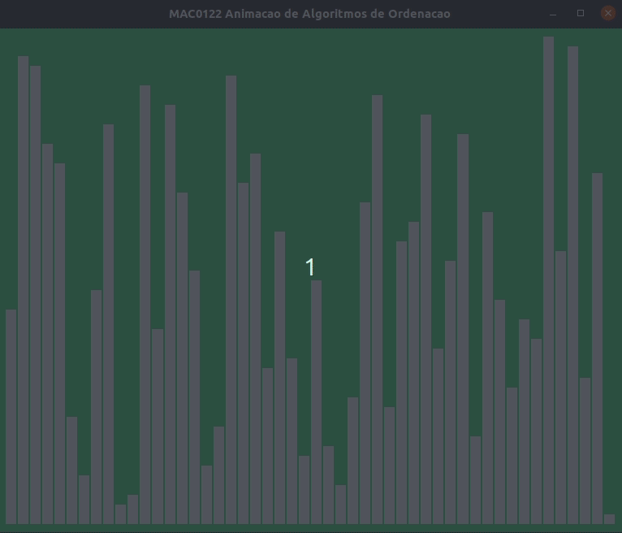

# EG23

Data de entrega: quinta, 18 nov 2021, 13:00
Arquivos requeridos: eg_pivotacao.py ( Baixar)
Tipo de trabalho: Trabalho individual

## De pivotação a ordenação

<div style="text-align: center">

<br>
Fonte: <a href="https://tvtropes.org/pmwiki/pmwiki.php/Main/TheWallsAreClosingIn">The Walls Are Closing In.</a>
</div>

### Preparação padrão

Voltem a sala principal caso você esteja sozinhE.

Preencham o Formulário Individual conforme as instruções.

Escolham a pessoa estagiária e a pessoa gerente conforme as instruções.

Sugerimos que o gerente leia as instruções em voz alta para que todos possam acompanhar a leitura e colaborar para o seu entendimento.

Façam uma cópia do seu EI, colocando o prefixo eg\_. Alternativamente, há um arquivo eg_pivotacao.py com um esqueleto deste EG que pode ser baixado desta página. Este esqueleto contém funções totalmente feitas que usaremos nos experimentos.

Baixem daqui o programa experimento.py que usaremos para fazermos nossas análises experimentais das funções desenvolvidas .

Se tiverem alguma dúvida chamem o Hitoshi ou o Coelho. Eles devem estar passeando pelas salas.

---

### EI: pivotação

<div style="text-align: center">
<span> </span>
<br>pivote_seq() fazendo seu serviço
</div>

#### Testes

Testem as funções que vocês fizeram para o EI:

- pivote_seq(seq) e
- main()

Usem para isso as coletânea de testes que cada uma/um fez na função main().

A pessoa estagiária deve agrupar todos os testes na main() do time e compartilhar main() com as demais pessoas do time para que todos possam testar os seus trabalhos individuais.

A propósito, a função pivote_seq(seq) faz parte de uma família de funções conhecidas como partition ou partition scheme.

#### Testes individuais

Cada pessoa do time deve verificar as funções do seu EI/EG estão dentro da especificação. Por exemplo, pivote_seq(seq) recebe uma lista, rearranja os seus elementos e retorna um índice.

Não hesite em pedir ajuda a seu time em caso de dificuldades.

Caso algum problema seja encontrado, discuta com suas/seus colegas de time para resolvê-lo. Elas/eles ficarão muito felizes em lhe ajudar.

#### Reflexão

Algumas questões para discutirem.

Qual o número de comparações entre elemento da lista são feitas pela suas função pivote_seq(seq) quando

- seq=[11, 5, 2, 7, 15] ?
- seq=[7, 5, 2, 11, 1] ?
- seq=[7, 5, 2, 11, 6] ?

Em geral, se uma lista seq tem n elementos, aproximadamente quantas comparações entre elementos da lista são feitas por pivote_seq(seq) no melhor caso e no pior caso?

Em notação assintótica, qual o consumo de tempo da sua função no melhor caso (= a função trabalha pouco) e no pior caso (= a função se mata de trabalhar)? É O(1)? É O(lg n)? É O(n)? É O(nlg n)? É O(n2)? É O(n3)? É O(2n)? É O(?))?

---

### Desafio: de pivotação a ordenação

<div style="text-align: center">
  
  <br>
  Fonte: Quicksort (Wikipedia).
</div>

Ao final da execução de pivote_seq(seq), o elemento que foi eleito pivô está sentado na sua posições de direito na lista ordenada. Tenham em mente esta observação, pois ela será chave na função de ordenação que vocês construirão.

Diremos que os elementos de uma lista seq[i:j] estão em ordem crescente se seq[i] ≤ seq[i + 1] ≤ seq[i + 2] ≤ ⋯ ≤ seq[j − 1].
As vezes, de maneira abreviada, falaremos que a lista seq[i:j] é crescente significando que seus elementos estão em ordem crescente.

O desafio deste EG consiste em escrever duas funções:

- pivote(seq, e, d) e
- ordene_por_pivotacaoR(seq, e, d)

Discutiremos uma função por vez.

---

#### pivote(seq, e, d)

A especifição desta função está a seguir. Se vocês estiverem em busca de inspiração, vejam a função pivote_seq() que é muito semelhante a esta. O vídeo no EI e as animações e ilustrações neste enunciado também podem ajudar.

```
def pivote(seq, e, d):
    ''' (list) -> int

    RECEBE uma lista seq e dois inteiros e < d. Chamaremos
        de pivô o elemento na posição seq[d-1].
    REARRANJA os elementos de seq de tal forma que para algum
        índice m, e <= m < d tenhamos
        * seq[m] == pivô e
        * seq[e: m] <= pivô < seq[m+1: d].
    RETORNA o índice m.
    '''
```

Como de hábito, aqui vão alguns exemplos de execução da função.

```
    In [2]: seq = [7, 11, 56, 5, 7, 99, 104]
    In [3]: m = pivote(seq, 0, 7)
    In [4]: m
    Out[4]: 6
    In [5]: seq
    Out[5]: [7, 11, 56, 5, 7, 99, 104]

    In [6]: seq = [7, 11, 56, 5, 7, 99, 10]
    In [7]: m = pivote(seq, 0, 7)
    In [8]: m
    Out[8]: 3
    In [9]: seq
    Out[9]: [7, 7, 5, 10, 11, 99, 56]

    In [10]: seq = [7, 11, 56, 5, 7, 99, -10]
    In [11]: m = pivote(seq, 0, 7)
    In [12]: m
    Out[12]: 0
    In [13]: seq
    Out[13]: [-10, 11, 56, 5, 7, 99, 7]

    In [14]: seq = [99, 99, 99, 7, 11, 56, 5, 7, 13, -10, -10]
    In [15]: m = pivote(seq, 3, 9)
    In [16]: m
    Out[16]: 7
    In [17]: seq
    Out[17]: [99, 99, 99, 7, 11, 7, 5, 13, 56, -10, -10]

    In [19]: seq = [99, 99, 99, 7, 11, 56, 5, 7, 6, -10, -10]
    In [20]: m = pivote(seq, 3, 9)
    In [21]: m
    Out[21]: 4
    In [22]: seq
    Out[22]: [99, 99, 99, 5, 6, 56, 7, 7, 11, -10, -10]
```

Antes de continuar…

Qual o consumo de tempo da sua função pivote(seq, e, d) no melhor caso (= a função trabalha pouco) e no pior caso (= a função se mata de trabalhar) supondo que n=d-e? É O(1)? É O(lg n)? É O(n)? É O(nlg n)? É O(n2)? É O(n3)? É O(2n)? É O(?)?

Qual é aproximadamente a quantidade de espaço extra usado pela função pivote(seq, e, d) supondo que n=d-e? Considerem que a quantidade de espaço extra é o número de variáveis que sua função usa como rascunho para fazer o serviço e que são descartadas ao final. Cada posição em uma lista deve ser contada como uma variável.

Mais adiante vocês confrontarão as suas conclusões com a realidade através de experimentos.

---

#### ordene_por_pivotacaoR(seq, e, d)

<div style="text-align: center">
  
  <br>
  Fonte: Quicksort in Javascript.
</div>

A especificação da função ordene_por_pivotacaoR(seq, e, d) está logo abaixo. A função se apoia de todo coração em recursão e na colaboração indispensável da função pivote(seq, e, d)! Busquem inspiração no mergesort e nas imagens e animações nesta página.

```
def ordene_por_pivotacaoR(seq, e, d): # EG: DESAFIO
    '''(list, int, int) -> None
    RECEBE uma lista seq e um par de índice e <= d.
    REARRANJA os elementos de seq[e: d] para que fiquem em ordem crescente.

    '''
```

Alguns exemplos…

```
    In [57]: seq = [99, 58, 17, -1, 7, 11, 56, 5, 7, 59, -1, 22]
    In [58]: m = pivote(seq, 0, 12) # divide
    In [59]: m
    Out[59]: 7
    In [60]: seq
    Out[60]: [-1, 7, 17, -1, 7, 11, 5, 22, 58, 59, 99, 56]

    In [60]: seq
    Out[60]: [-1, 7, 17, -1, 7, 11, 5, 22, 58, 59, 99, 56]
    In [61]: ordene_por_pivotacaoR(seq, 0, 7)
    In [62]: seq
    Out[62]: [-1, -1, 5, 7, 7, 11, 17, 22, 58, 59, 99, 56]

    In [62]: seq
    Out[62]: [-1, -1, 5, 7, 7, 11, 17, 22, 58, 59, 99, 56]
    In [63]: ordene_por_pivotacaoR(seq, 8, 12)
    In [64]: seq
    Out[64]: [-1, -1, 5, 7, 7, 11, 17, 22, 56, 58, 59, 99]

    In [64]: seq
    Out[64]: [-1, -1, 5, 7, 7, 11, 17, 22, 56, 58, 59, 99]

    In [65]: seq = [99, 58, 17, -1, 7, 11, 56, 5, 7, 59, -1, 0]
    In [66]: m = pivote(seq, 0, 12) # divide
    In [67]: m
    Out[67]: 2
    In [68]: seq
    Out[68]: [-1, -1, 0, 58, 7, 11, 56, 5, 7, 59, 99, 17]

    In [68]: seq
    Out[68]: [-1, -1, 0, 58, 7, 11, 56, 5, 7, 59, 99, 17]
    In [69]: ordene_por_pivotacaoR(seq, 3, 12)
    In [70]: seq
    Out[70]: [-1, -1, 0, 5, 7, 7, 11, 17, 56, 58, 59, 99]

    In [70]: seq
    Out[70]: [-1, -1, 0, 5, 7, 7, 11, 17, 56, 58, 59, 99]

    In [74]: seq = [99, 99, 17, -1, 7, 11, 56, 5, 7, 9, -10, -10]
    In [75]: ordene_por_pivotacaoR(seq, 2, 10)
    In [76]: seq
    Out[76]: [99, 99, -1, 5, 7, 7, 9, 11, 17, 56, -10, -10]
```

---

### Ordenação por pivotação

No arquivo eg_pivotacao.py vocês encontram duas funções totalmente implementadas:

- ordene_por_pivotacao(): é um invólucro para a função ordene_por_pivotacaoR()
- ordene_por_pivotacaoI(): é uma versão iterativa da ordenação por pivotação.

Essas funções são conhecidas pelo nome comercial de Quicksort.

---

### Análise experimental

Agora vocês devem deixar as funções trabalharem em paz, apreciar a vista e observar atentamente o que estão vendo.

Baixem o arquivo experimento.py. Este arquivo fará experimentos com as funções:

- ordene_por_insercao(), feita na semana passada;
- ordene_por_pivotacao(),
- ordene_por_pivotacaoI().

Baseado nesses experimentos, qual função teve o melhor desempenho para listas

- aleatórias?
- crescentes ou quase crescentes?
- decrescentes ou quase decrescentes?

---

### Mais um pouco de reflexão

Algumas questões para discutirem.

Baseados nas suas análises para o consumo de tempo da função pivote(), qual é o consumo de tempo de ordene_por_pivotacao() no melhor caso e no pior caso para ordenar uma lista seq com n elementos? É O(1)? É O(lg n)? É O(n)? É O(nlg n)? É O(n2)? É O(n3)? É O(2n)?.

Os tempos obtidos nos experimentos comprovam a suas conclusões sobre o consumo de tempo? Por quê?

---

### Lições

No quicksort quem trabalha mesmo é a função pivote(). Após a lista ser dividida em duas através da pivotação, não ocorrerão mais comparações entre pares de elementos em sublistas diferentes. O quicksort e o mergesort são exemplos de algoritmos que utilizam a técnica chamada divisão e conquista.

Um algoritmo de divisão e conquista divide recursivamente um problema em dois ou mais subproblemas da mesma espécie, até que se tornem simples o suficiente para serem resolvidos diretamente na base da recursão. As soluções para os subproblemas são então combinadas para fornecer uma solução para o problema original.

Por exemplo, em cada nível da recursão do quicksort são realizados três passos:

     e                                                 d

--+----+----+----+----+----+----+----+----+----+----+--  
 | 99 | 33 | 55 | 77 | 11 | 22 | 88 | 66 | 33 | 44 |  
 --+----+----+----+----+----+----+----+----+----+----+--

1.  dividir: a função pivote() divide a sublista em sublistas menores

        e                   m                             d

    --+----+----+----+----+----+----+----+----+----+----+--  
     | 33 | 33 | 22 | 11 | 44 | 55 | 88 | 66 | 99 | 77 |  
    --+----+----+----+----+----+----+----+----+----+----+--

2.  conquistar: as sublistas menores são ordenadas recursivamente

--+----+----+----+----+ +----+----+----+----+----+--
| 11 | 22 | 33 | 33 | | 55 | 66 | 77 | 88 | 99 |  
 --+----+----+----+----+ +----+----+----+----+----+--

3. combinar: as ordenações das sublistas menores são combinadas para obtermos uma ordenação da sublista original

--+----+----+----+----+----+----+----+----+----+----+--
| 11 | 22 | 33 | 33 | 44 | 55 | 66 | 77 | 88 | 99 |
--+----+----+----+----+----+----+----+----+----+----+--

Vocês pode ler mais sobre o Quicksort no livro capítulo O Quick sort do livro Resolução de Problemas com Algoritmos e Estruturas de Dados usando Python.

Ideias? Comentários? Perguntas?
Para conseguir um bônus …

Para entregar o EG não é necessário modificar o cabeçalho do seu EI (exercício individual), ou seja, use o mesmo cabeçalho e faça as modificações que desejar no código do EI, seguindo ou não as discussões do time.

Você só precisa entregar o arquivo com extensão eg\_ contendo os novos métodos e/ou funções implementados, inclusive a main() utilizada para testes.

Você também precisa responder o formulário individual cujo link está no início deste EG.

Lembre-se de testar a solução antes de entregá-la e conferir suas respostas. O bônus recebido será 10% da nota do seu EG.

Não serão aceitos EGs após encerrado o prazo de entrega.

---

### Quicksort recursivo

<div style="text-align: center">
<span> </span>
<br>Quicksort: versão recursiva e iterativa
</div>

A função ordene_por_pivotacao() é apenas um envoltório para a função ordene_por_pivotacaoR(). O conjunto da obra é uma versão recursiva do Quicksort.

```
def ordene_por_pivotacao(seq):
    '''(list) -> None
    RECEBE uma lista seq.
    REARRANJA os elementos de seq para que fiquem em ordem crescente.
    '''
    n = len(seq)
    ordene_por_pivotacaoR(seq, 0, n)
```

Aqui estão exemplos de alguns resultados produzidos pela função.

```
    In [2]: seq = [99, 58, 17, -1, 7, 11, 56, 5, 7, 59, -1]
    In [3]: ordene_por_pivotacao(seq)
    In [4]: seq
    Out[4]: [-1, -1, 5, 7, 7, 11, 17, 56, 58, 59, 99]

    In [11]: seq = ['como', 'é', 'muito', 'bom', 'estudar', 'mac0122!']
    In [12]: ordene_por_pivotacao(seq)
    In [13]: seq
    Out[13]: ['bom', 'como', 'estudar', 'mac0122!', 'muito', 'é']
```

---

### Quicksort iterativo e espaço extra

A função ordene_por_pivotacaoI() é uma versão iterativa do Quicksort. Esta versão iterativa caminha sobre as pegadas da versão recursiva, ou seja, simula a versão recursiva. Para isso esta versão iterativa usa uma pilha em que os elementos são pares de índices (e, d) sobre os quais ainda devemos aplica a função pivote(). A lista pilha na nossa implementação, portanto, simula de uma forma explícita o serviço feito pela pilha da recursão que é implícita na versão recursiva do Quicksort. Tanto na nossa versão recursiva quanto nossa versão iterativa o espaço extra usado pelo Quicksort no pior caso é proporcional ao número de elementos desta pilha, que pode ser O(n), em que n é o número de elementos na lista que desejamos ordenar. Entretanto, se aplicarmos mais algumas ideias podemos trazer este espaço extra para o patamar O(lg n). Mas isso é uma outra história…

---

### Arquivos requeridos

##### eg_pivotacao.py

```
# -*- coding: utf-8 -*-

#------------------------------------------------------------------
# LEIA E PREENCHA O CABEÇALHO
#------------------------------------------------------------------

'''

    Nome:
    NUSP:

    Ao preencher esse cabeçalho com o meu nome e o meu número USP,
    declaro que todas as partes originais desse exercício programa
    foram desenvolvidas e implementadas por mim e que, portanto, não
    constituem desonestidade acadêmica ou plágio.

    Entendo que trabalhos sem assinatura devem receber nota zero e, ainda
    assim, poderão ser punidos por desonestidade acadêmica.
    Declaro também que sou responsável por todas as cópias desse
    programa e que não distribui ou facilitei a sua distribuição.

    Estou ciente que os casos de plágio e desonestidade acadêmica
    estarão sujeitos às penalidades descritas na página da disciplina
    na seção "Sobre colaboração em MAC0122".

    Reconheço que utilizei as seguintes fontes externas ao conteúdo
    utilizado e recomendado em MAC0122, ou recebi auxílio das pessoas
    listadas abaixo.

    - LISTA de fontes externas utilizadas (links ou referências como livros)
        -

    - LISTA das pessoas que me auxiliaram a fazer esse trabalho
        -
'''

## -----------------------------------------------------------------
def main():
    '''
        Testes das suas funções

        Deve conter ao menos 10 testes distintos cobrindo casos
        básicos, como listas de tamanho mínimo, em ordem crescente,
        decrescente, etc.
    '''
    print("Testes do EG23 - ordenação por pivotação")

## -----------------------------------------------------------------

def pivote_seq(seq): # EI
    ''' (list) -> int

    RECEBE uma lista seq com pelo menos 1 elemento. Chamaremos
        de pivô o elemento na posição seq[-1].
    REARRANJA os elementos de seq de tal forma que para algum
        índice m tenhamos
        * seq[m] == pivô e
        * seq[ : m] <= pivô < seq[m+1: ].
    RETORNA o índice m.

    Em busca de inspiração? O vídeo no enunciado do EI ilustra
    uma possível implementação desta função.
    '''
    # escreva sua solução

## ------------------------------------------------------------------

def pivote(seq, e, d): # EG: DESAFIO
    ''' (list) -> int

    RECEBE uma lista seq e dois inteiros e < d. Chamaremos
        de pivô o elemento na posição seq[d-1].
    REARRANJA os elementos de seq de tal forma que para algum
        índice m, e <= m < d tenhamos
        * seq[m] == pivô e
        * seq[e: m] <= pivô < seq[m+1: d].
    RETORNA o índice m.

    SUGESTÃO: Em busca de inspiração?
    Esta função é muito semelhante a função pivote_seq().
    Veja o vídeo no EI e as animações e ilustrações no
    enunciado do EG.

    EXEMPLOS

    In [2]: seq = [7, 11, 56, 5, 7, 99, 104]
    In [3]: m = pivote(seq, 0, 7)
    In [4]: m
    Out[4]: 6
    In [5]: seq
    Out[5]: [7, 11, 56, 5, 7, 99, 104]

    In [6]: seq = [7, 11, 56, 5, 7, 99, 10]
    In [7]: m = pivote(seq, 0, 7)
    In [8]: m
    Out[8]: 3
    In [9]: seq
    Out[9]: [7, 7, 5, 10, 11, 99, 56]

    In [10]: seq = [7, 11, 56, 5, 7, 99, -10]
    In [11]: m = pivote(seq, 0, 7)
    In [12]: m
    Out[12]: 0
    In [13]: seq
    Out[13]: [-10, 11, 56, 5, 7, 99, 7]

    In [14]: seq = [99, 99, 99, 7, 11, 56, 5, 7, 13, -10, -10]
    In [15]: m = pivote(seq, 3, 9)
    In [16]: m
    Out[16]: 7
    In [17]: seq
    Out[17]: [99, 99, 99, 7, 11, 7, 5, 13, 56, -10, -10]

    In [18]: seq = [99, 99, 99, 7, 11, 56, 5, 7, 13, -10, -10]
    In [19]: seq = [99, 99, 99, 7, 11, 56, 5, 7, 6, -10, -10]
    In [20]: m = pivote(seq, 3, 9)
    In [21]: m
    Out[21]: 4
    In [22]: seq
    Out[22]: [99, 99, 99, 5, 6, 56, 7, 7, 11, -10, -10]
    '''
    # escreva sua solução


## ------------------------------------------------------------------

def ordene_por_pivotacao(seq):
    '''(list) -> None
    RECEBE uma lista seq.
    REARRANJA os elementos de seq para que fiquem em ordem crescente.

    NOTA: É um invólucro para ordene_por_pivotacaoR().

    EXEMPLOS

    In [2]: seq = [99, 58, 17, -1, 7, 11, 56, 5, 7, 59, -1]
    In [3]: ordene_por_pivotacao(seq)
    In [4]: seq
    Out[4]: [-1, -1, 5, 7, 7, 11, 17, 56, 58, 59, 99]

    In [11]: seq = ['como', 'é', 'muito', 'bom', 'estudar', 'mac0122!']
    In [12]: ordene_por_pivotacao(seq)
    In [13]: seq
    Out[13]: ['bom', 'como', 'estudar', 'mac0122!', 'muito', 'é']
    '''
    n = len(seq)
    ordene_por_pivotacaoR(seq, 0, n)

## ------------------------------------------------------------------

def ordene_por_pivotacaoR(seq, e, d): # EG: DESAFIO
    '''(list, int, int) -> None
    RECEBE uma lista seq e um par de índice e <= d.
    REARRANJA os elementos de seq[e: d] para que fiquem em ordem crescente.

    Esta função deve ser RECURSIVA e deve se APOIAR na função pivote(seq, e, d).
    Busque inspiração na busca binária, no mergesort e nas animações na página
    do EG.

    EXEMPLOS

    In [57]: seq = [99, 58, 17, -1, 7, 11, 56, 5, 7, 59, -1, 22]
    In [58]: m = pivote(seq, 0, 12)
    In [59]: m
    Out[59]: 7
    In [60]: seq
    Out[60]: [-1, 7, 17, -1, 7, 11, 5, 22, 58, 59, 99, 56]
    In [61]: ordene_por_pivotacaoR(seq, 0, 7)
    In [62]: seq
    Out[62]: [-1, -1, 5, 7, 7, 11, 17, 22, 58, 59, 99, 56]
    In [63]: ordene_por_pivotacaoR(seq, 8, 12)
    In [64]: seq
    Out[64]: [-1, -1, 5, 7, 7, 11, 17, 22, 56, 58, 59, 99]

    In [65]: seq = [99, 58, 17, -1, 7, 11, 56, 5, 7, 59, -1, 0]
    In [66]: m = pivote(seq, 0, 12)
    In [67]: m
    Out[67]: 2
    In [68]: seq
    Out[68]: [-1, -1, 0, 58, 7, 11, 56, 5, 7, 59, 99, 17]
    In [69]: ordene_por_pivotacaoR(seq, 3, 12)
    In [70]: seq
    Out[70]: [-1, -1, 0, 5, 7, 7, 11, 17, 56, 58, 59, 99]

    In [74]: seq = [99, 99, 17, -1, 7, 11, 56, 5, 7, 9, -10, -10]
    In [75]: ordene_por_pivotacaoR(seq, 2, 10)
    In [76]: seq
    Out[76]: [99, 99, -1, 5, 7, 7, 9, 11, 17, 56, -10, -10]
    '''
    # escreva sua solução


## ------------------------------------------------------------------

def ordene_por_pivotacaoI(seq):
    '''(list) -> None
    RECEBE uma lista seq.
    REARRANJA os elementos de seq para que fiquem em ordem crescente.

    É uma função ITERATIVA que se APOIA na função pivote(seq, e, d).
    Para entender o seu funcionamente pode ser útil ver as animações
    e exemplos na página do EG.

    EXEMPLOS

    In [34]: seq = [99, 58, 17, -1, 7, 11, 56, 5, 7, 59, -1]
    In [35]: ordene_por_pivotacaoI(seq)
    In [36]: seq
    Out[36]: [-1, -1, 5, 7, 7, 11, 17, 56, 58, 59, 99]

    In [37]: seq = ['como', 'é', 'muito', 'bom', 'estudar', 'mac0122!']
    In [38]: ordene_por_pivotacaoI(seq)
    In [39]: seq
    Out[39]: ['bom', 'como', 'estudar', 'mac0122!', 'muito', 'é']
    '''
    n = len(seq)
    e = 0
    d = n
    pilha = []
    pilha.append((e, d))
    while pilha != []:
        e, d = pilha.pop()
        if e < d-1: # seq[e: d]) tem pelo menos dois elementos
            m = pivote(seq, e, d)
            # empilhe par de índices da fatia esquerda
            pilha.append((e, m))
            # empilhe par de índice da fatia direita
            pilha.append((m+1, d))

## ------------------------------------------------------------------

def ordene_por_insercao(seq):
    ''' (list) -> None

    RECEBE uma lista seq.
    REARRANJA os elementos da lista de tal forma que fiquem em
        ordem crescente.

    Esta função se apoio na função insira_ultimo.
    '''
    n= len(seq)
    for fim in range(2, n+1):
        insira_ultimo(seq, fim)

## ------------------------------------------------------------------

def insira_ultimo(seq, n):
    ''' (list, int) -> None

    RECEBE uma lista seq e um inteiro n tais que os elementos da
         sublista seq[0:n-1] estão em ordem crescente.
    REARRANJA os elementos da lista seq de tal forma que os
         elementos da sublista seq[0:n] estejam em ordem crescente.

    Essa função é o coração do algoritmo de ordenação
    por inserção.
    '''
    i = n-1
    while i > 0 and seq[i] < seq[i-1]:
        seq[i], seq[i-1] = seq[i-1], seq[i]
        i -= 1


#-----------------------------------------------
if __name__ == '__main__':
    main()
```
