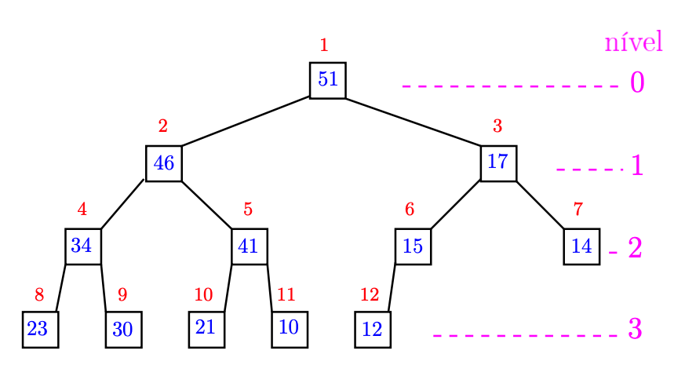
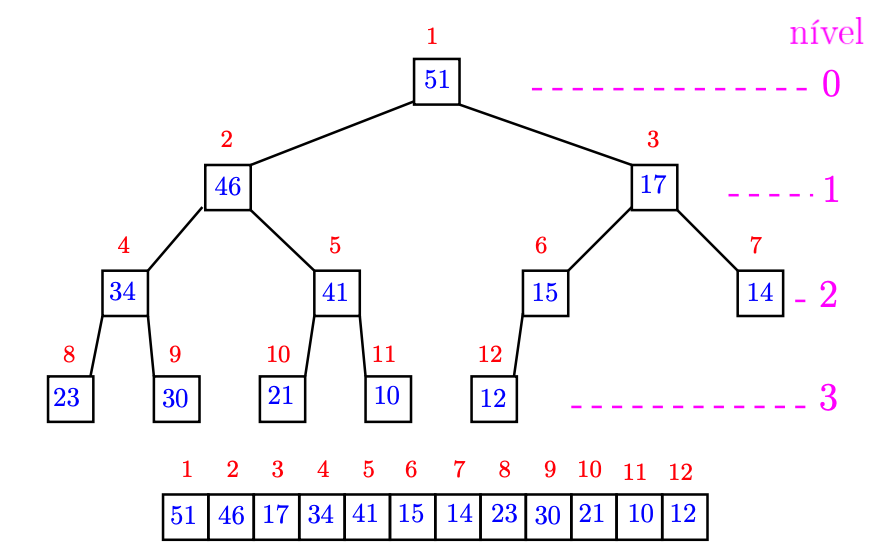

# EI24

Data de entrega: segunda, 22 nov 2021, 22:00
Arquivos requeridos: heap.py ([Baixar](https://edisciplinas.usp.br/mod/vpl/views/downloadrequiredfiles.php?id=3971683))
Tipo de trabalho: Trabalho individual

## Heapsort: ordenação usando max heap

### Objetivos

Uma estrutura de dados é uma maneira de organizamos os dados/valores para que sejam manipulados eficientemente por nossos programas.

Neste exercício vamos estudar uma estrutura de dados, conhecida como heap, que é a base de um algoritmo de ordenação ainda mais sofisticado conhecido como Heapsort.

Esses tais de heaps são muito espertos para encontrar um maior ou menor elemento de alguma coleção de valores.
Isso diz que eles são ideias para ajudarem a ordenação por seleção a encontrar em cada iteração um maior elemento de uma sublista.

---

### Motivação

Como vimos nos capítulos anteriores, o Mergesort é muito rápido, consome tempo O(n lg  n) em que n é o número de elementos a serem ordenado. O preço de tanta eficiência é a necessidade de espaço para rascunho que pode ser proporcional a n, é o chamado espaço extra O(n).

Apesar da modéstia no nome, o Quicksort no pior caso consome tempo O(n2) e usa espaço extra O(n). Na sua versão recursiva o espaço extra do Quicksort fica meio escondido numa coisa chamada pilha da recursão. Já na nossa versão iterativa o espaço extra está explícito na lista usada e que demos o nome de pilha.

Bem, verdade seja dita, no dia a dia o Quicksort é muito rápido mesmo e merece o seu nome de batismo. Seu consumo de tempo é O(n lg  n) e espaço extra é O(lg  n).

Nesse exercício vocês implementarão parte de uma classe que chamaremos de Heap. Essa implementação permitirá um heap seja construído através da inserção de um item por vez. Mais tarde veremos que com um pouco mais de trabalho essa classe poderá ser usada para projetarmos uma função que consome tempo O(n lg  n) e espaço extra O(1) (!) para ordenar uma lista com n elementos.

<div style="text-align: center">
  
  <br>
  Fonte: Trees.
</div>

### Heap

Essa seção é baseada na página Heapsort do Professor Paulo Feofiloff.

Um heap (= monte) é uma árvore binária que pode ser organizada como max-heap ou min-heap; trataremos apenas de max-heap, inclusive muitas vezes omitindo o prefixo “max”.

Uma árvore binária é uma estrutura como ilustrada abaixo, onde cada nó pode apresentar até dois filhos, que vamos denominar filho esquerdo e filho direito.

<div style="text-align: center">
  
  <br>
  Exemplo de árvore binária max heap
</div>

Nesse exemplo, o primeiro nó da árvore (nó 1), também chamado de raiz, contém o valor 51. Seu filho esquerdo (nó 2) contém o valor 46 e o direito 17 (nó 3). Para simplificar, vamos muitas vezes dizer apenas que “os filhos de 51 são 46 e 17”, ou que “o pai de 17 é 51”.

Uma propriedade importante do max heap é que um nó pai tem valor maior ou igual ao valor dos seus filhos (ou simplesmente, o pai é maior ou igual aos filhos). Observe que a árvore binária dessa figura é um max heap pois apresenta essa propriedade. Por exemplo, para o nó 5, temos que 41 é pai de 21 e 10. Observe que nem todos os nós tem filhos. Nós sem filhos são chamados de folhas da árvore. Observe também que alguns nós podem ter apenas um filho, como é o caso do nó 6.

Por ser uma árvore binária, observe que cada nível k da árvore possui 2k nós, ou seja, o nível 0 tem apenas um elemento (a raiz), o nível 2 tem 4 nós, o nível 3 tem 8, etc. No entanto, o último nível da árvore não precisa estar completo, como mostra o exemplo na figura, que traz 5 folhas no último nível (e mais uma folha no nível 2).

<span style="color:green; font-weight:bold; font-size:20px;">Representação de árvore binária como lista em Python</span>

Observe com atenção a numeração dos nós da árvore binária como mostrada na figura, ou seja, a raiz no nó 1, os filhos da raiz nos nós 2 e 3, e assim por diante.

Vamos usar essa mesma numeração como sendo os índices de uma lista em Python, e desconsiderar o índice 0 (você pode assumir que a posição 0 da lista contém None).

<div style="text-align: center">
  
  <br>
  Representação de uma árvore binária max heap usando lista.
</div>

<span style="color:green; font-weight:bold; font-size:20px;">Método insira()</span>

Para entender como inserir um novo elemento no max heap, peque lápis e papel, e copie/desenhe a árvore em uma folha de papel.

Vamos assumir que precisamos inserir o valor 44 nessa árvore. A inserção na árvore binária se faz criando o nó 13 com o valor 44. Desenhe um nó 13, filho direito do nó 6, com valor 44.

Observe que após a inserção do 44, a árvore deixou de ser max heap. Para consertar o max heap, precisamos fazer o 44 subir até sua posição correta. Para isso, podemos comparar o 44 com seu pai, 15 (no nó 6 da árvore). Nesse caso, como o pai é menor, o 44 “sobe” para o nó 6 e o 15 “desce” para o nó 13. Desenhe essa troca para sentir o que está acontecendo.

Agora devemos continuar o processo com o pai do nó 6, que é o nó 3. Como 17 é menor que 44, o 44 “sobe” novamente (e o 17 “desce”). Desenhe essa troca.

O processo deve continuar comparando 44 com 51 mas, nesse caso, como o pai 51 é maior que o filho 44, então o processo termina e o resultado é um max heap.

Agora, experimente inserir outros valores, como 8 e 88, para ver se você entendeu o processo.
<span style="color:green; font-weight:bold; font-size:20px;">Mesmo processo, mas usando a lista</span>

Considere agora a representação da árvore usando lista. A inserção de 44 pode ser feita por um simples append() na lista. Observe que o índice desse novo elemento é 13.

A adoção dessa numeração (começando do 1) facilita a descoberta do pai e filhos de cada nó. Assim, dado um índice f (filho ou nó da árvore) qualquer, então:

- o índice do pai (caso exista) é dado por f//2,
- o índice do filho esquerdo (caso exista) é dado por 2\*f e
- o índice do filho direito (caso exista) é dado por 2\*f + 1.

Usando o mesmo exemplo anterior, então

- o pai do nó 13 é 13//2 = 6,
- o pai do nó 6 é o nó 6//2 = 3, e
- o pai do nó 3 é o nó 3//2 = 1.

Observe que a raiz não tem pai e portanto o processo não deve prosseguir após atingir a raiz.

Resumindo, para inserir um novo elemento no max heap, basta inserir no final da lista e, enquanto o pai desse elemento for menor, esse novo elemento sobe na árvore até atingir sua posição correta. Esse processo pode ser feito em tempo O(lg  n).

Aproveite para desenhar no papel o que acontece com as listas, usando os mesmos valores que você usou com a árvore binária.

---

### O que você deve fazer

Nesse exercício você deve implementar 2 métodos da classe Heap:

- insira(self, item)
- construa(self, seq)

como descritos no arquivo heap.py. Antes de implementar esses 2 métodos, estude os métodos já implementados dessa classe. Esses métodos já implementados não devem ser modificados.

O comportamento desses métodos pode ser observado pela saída do seguinte trecho de programa:

```
def main():

    print("Testes do EI24 - ordenação usando max heap")

    x = [21, 12, 43, 61, 41, 71, 91, 31, 81]
    print(f"Entrada:\n{x}")

    print("\n testes do insira")

    h = MaxHeap()
    for item in x:
        h.insira(item)
        print(h)
        input("Tecle enter para continuar ...")

    print("\n teste do construa")
    h = MaxHeap()
    h.construa(x)
    print(h)
```

A saída esperada é:

```
Testes do EI24 - ordenação usando max heap
Entrada:
[21, 12, 43, 61, 41, 71, 91, 31, 81]

testes do insira

21

Tecle enter para continuar ...

21
12

Tecle enter para continuar ...

43
12 21

Tecle enter para continuar ...

61
43 21
12

Tecle enter para continuar ...

61
43 21
12 41

Tecle enter para continuar ...

71
43 61
12 41 21

Tecle enter para continuar ...

91
43 71
12 41 21 61

Tecle enter para continuar ...

91
43 71
31 41 21 61
12

Tecle enter para continuar ...

91
81 71
43 41 21 61
12 31

Tecle enter para continuar ...

teste do construa

91
81 71
43 41 21 61
12 31
```

---

### Roteiro

- Baixe o arquivo heap.py para uma pasta do seu computador.
- Carregue esse arquivo usando o Spyder ou Colab ou seu IDE Python predileto.
- Leia o cabeçalho do arquivo com atenção e edite o cabeçalho colocando seu nome e NUSP.
- Estude o conteúdo do arquivo, esse enunciado e os exemplos fornecidos para entender o que você deve implementar.
- Implemente, documente e teste seu trabalho.
- Submeta apenas o arquivo heap.py.

---

### Honestidade acadêmica

Esse é um exercício individual, não em grupo. Isso não significa que você não pode receber ajuda de outras pessoas, inclusive de seus colegas. De uma forma geral, gostaríamos de incentivar as discussões de ideias, conceitos e alternativas de solução. Nossa maior recomendação é evitar olhar o código fonte de uma solução antes de escrever o seu programa. Em caso de dúvida, consulte a página Sobre colaboração em MAC0122

De forma sucinta, evite as seguintes ações que caracterizam desonestidade acadêmica na realização dos trabalhos individuais desse curso:

- buscar e obter uma solução (parcial ou completa, correta ou não) de exercício programa (EP) na internet ou qualquer outro meio físico ou virtual, durante o período de submissão do referido EP;
- solicitar ou obter uma cópia (parcial ou completa, correta ou não) da solução de um EP durante o seu período de submissão;
- permitir que um colega acesse uma cópia (parcial ou completa, correta ou não) do seu EP, durante o período de submissão;
- ainda mais grave é o plágio, que se configura pela utilização de qualquer material não visto em aula ou não descrito no enunciado, que não seja de sua autoria, em parte ou ao todo, e entregar, com ou sem edição, como se fosse seu trabalho, para ser avaliado.

---

### Arquivos requeridos

##### heap.py

```
# -*- coding: utf-8 -*-

#------------------------------------------------------------------
# LEIA E PREENCHA O CABEÇALHO
#------------------------------------------------------------------

'''

    Nome:
    NUSP:

    Ao preencher esse cabeçalho com o meu nome e o meu número USP,
    declaro que todas as partes originais desse exercício programa
    foram desenvolvidas e implementadas por mim e que, portanto, não
    constituem desonestidade acadêmica ou plágio.

    Entendo que trabalhos sem assinatura devem receber nota zero e, ainda
    assim, poderão ser punidos por desonestidade acadêmica.
    Declaro também que sou responsável por todas as cópias desse
    programa e que não distribui ou facilitei a sua distribuição.

    Estou ciente que os casos de plágio e desonestidade acadêmica
    estarão sujeitos às penalidades descritas na página da disciplina
    na seção "Sobre colaboração em MAC0122".

    Reconheço que utilizei as seguintes fontes externas ao conteúdo
    utilizado e recomendado em MAC0122, ou recebi auxílio das pessoas
    listadas abaixo.

    - LISTA de fontes externas utilizadas (links ou referências como livros)
        -

    - LISTA das pessoas que me auxiliaram a fazer esse trabalho
        -
'''

## ==================================================================
def main():

    print("Testes do EI24 - ordenação usando max heap")

    x = [21, 12, 43, 61, 41, 71, 91, 31, 81]
    print(f"Entrada:\n{x}")

    print("\n testes do insira")

    h = MaxHeap()
    for item in x:
        h.insira(item)
        print(h)
        input("Tecle enter para continuar ...")

    print("\n teste do construa")
    h = MaxHeap()
    h.construa(x)
    print(h)

## ==================================================================

class MaxHeap:

    def __init__(self):
        ''' (MaxHeap) -> None
        Construtor da classe MaxHeap.
        Cria uma lista self.data com [None].
        '''
        self.data = [None]

    def __len__(self):
        ''' (MaxHeap) -> int
        Retorna o número de elementos no heap.
        O elemento no índice zero não faz parte do heap.
        '''
        return len(self.data) - 1

    def __str__(self):
        ''' (MaxHeap) -> str
        Retorna uma representação texto do heap.
        '''

        n = len(self.data)
        dt = self.data

        nivel = 0
        txt = '\n'

        i = 1
        while i < n:
            fim = 2 ** nivel
            nivel += 1
            filho = 0
            while i < n and filho < fim:
                txt += f'{dt[i]}\t'
                i += 1
                filho += 1
            txt += '\n'
        return txt

    def insira(self, item):
        ''' (MaxHeap, obj) -> None
        Recebe um objeto item e o insere no heap.

        Inicialmente, o item deve ser colocado no final da lista.
        Em seguida, enquanto o pai desse item for menor, o item
        deve subir na árvore até sua posição correta.

        Exemplo:
        Caso self.data seja a lista [None], a inserção de 21 deve
        rearranjar self.data para que se torne: [None, 21].

        Caso self.data seja a lista [None, 21], a inserção de 12 deve
        rearranjar self.data para que se torne: [None, 21, 12].

        Caso self.data seja a lista [None, 21, 12] a inserção de 43
        deve rearranjar self.data para que se torne: [None, 43, 12, 21].

        Caso self.data seja a lista [None, 43, 12, 21] a inserção de 65
        deve rearranjar self.data para que se torne: [None, 65, 43, 21, 12].

        Dica: desenhe as árvores binárias correspondentes.

        '''

        # escreva sua solução


    def construa(self, seq):
        ''' (MaxHeap, list) -> None
        Recebe uma lista de números seq.
        Para cada item em seq, insere o item no heap
        usando o método insira. Dessa forma, seq é
        transformada em um max heap em self.data.
        '''

        # escreva sua solução


if __name__ == '__main__':
    main()
```
