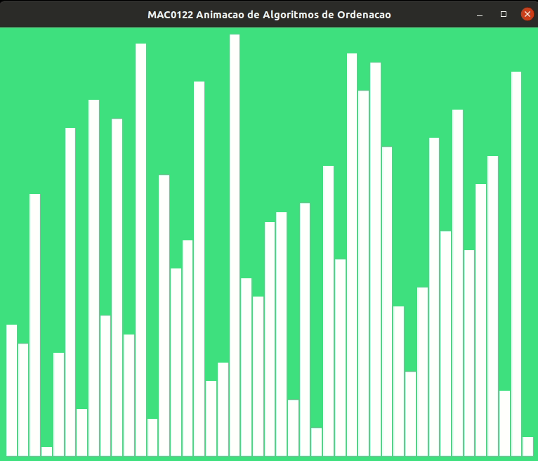
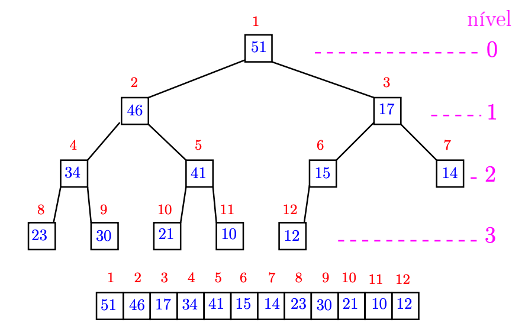
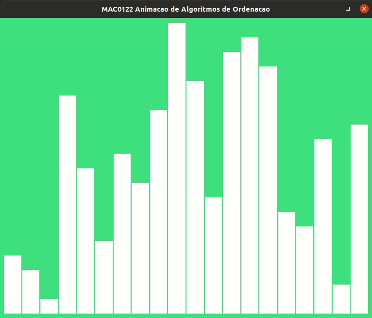
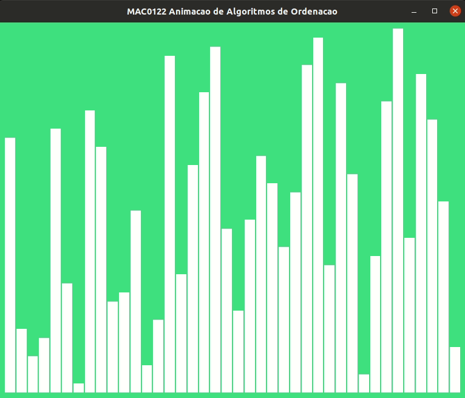

# EG24

Data de entrega: terça, 23 nov 2021, 11:00
Arquivos requeridos: eg_heap.py ([Baixar](https://edisciplinas.usp.br/mod/vpl/views/downloadrequiredfiles.php?id=3975116))
Tipo de trabalho: Trabalho individual

## De heaps a ordenação e até filas

<div align="center">
  
  <br>
  Fonte: <a href="http://xkcd.com/835/">xkcd</a>.
</div>

### Preparação padrão

Volte a sala principal caso você esteja sozinhE.

Preencham o Formulário Individual conforme as instruções.

Escolham a pessoa estagiária e a pessoa gerente conforme as instruções.

Sugerimos que o gerente leia as instruções em voz alta para que todos possam acompanhar a leitura e colaborar para o seu entendimento.

Façam uma cópia do seu EI, colocando o prefixo eg\_. Alternativamente, há um arquivo eg_heap.py com um esqueleto deste EG que pode ser baixado desta página. Este esqueleto contém algumas funções novas totalmente feitas que podem ser úteis.

[Baixem daqui](https://colab.research.google.com/drive/1pCS9zCHO0KL9td4sOXRNzco6cxcN0NHg?usp=sharing) o programa experimento.py que usaremos para fazermos nossas análises experimentais.

## Se tiverem alguma dúvida chamem o Hitoshi ou o Coelho. Eles devem estar passeando por ai ou foram ao banheiro.

### EI: MaxHeap

<div style="text-align: center">
  
  <br>
  Fonte: Heapsort (Wikipedia).
</div>

<span style="color:green; font-weight:bold; font-size:20px;">Testes</span>

Bem, está é a hora que vocês testam o que fizeram no EI, no caso é o momento de testar os métodos

- insira(self, item) e
- construa(self, seq)

da classe MaxHeap que vocês fizeram para o EI.

Usem para isso as coletânea de testes que cada uma/um fez na função main().

Uma das pessoas do time pode agrupar e compartilhar com as demais todos os testes na main(). Assim, todas e todos poderão testar os seus trabalhos individuais.

<div style="text-align: center">
  
  <br>
  Fonte: MaxHeap.construa() durante o expediente.
</div>

<span style="color:green; font-weight:bold; font-size:20px;">Testes individuais</span>

Cada pessoa do time deve verificar se os métodos do seu EI/EG estão dentro da especificação. Por exemplo, insira(self,item) e construa(self, seq) retornam None.

Idealmente vocês deveriam compartilhar suas dúvidas e ideias.

Caso algum problema seja encontrado, discuta com suas/seus colegas de time para resolvê-lo. Elas/eles ficarão muito felizes em lhe ajudar.

<span style="color:green; font-weight:bold; font-size:20px;">Antes de continuar…</span>

Algumas questões para discutirem.

Primeiro, sobre max-heap. Suponha que h é um objeto MaxHeap. Quais listas a seguir são legítimas representações para um max-heap da classe MaxHeap?

- h.data=[None, 1, 2, 3]
- h.data=[None, 3, 2, 1]
- h.data=[None, 3, 1, 2]
- h.data=[None, 15, 2, 1, 14]
- h.data=[None]
- h.data=[]

O esqueleto eg_heap.py contém uma método maxheap() que verifica se h é uma legitimamente representa um max-heap.

Agora, um pouco de eficiência Qual o número de comparações entre elemento de h são feitas por h.insereq(item) se

- h.data=[None, 15, 5, 11, 4, 3] e item = 10?
- h.data=[None, 15, 5, 11, 4, 3, 10] e item = 16?
- h.data=[None, 10, 9, 8, 7, 6, 5, 4, 3, 2, 1, 0] e item = 11?

Em geral, se h tem n itens, aproximadamente quantas comparações entre elementos da lista h.data são feitas por h.insera(item) no melhor caso e no pior caso?

Em notação assintótica, qual o consumo de tempo do seu método insira() no melhor caso? E no pior caso?

Suponha que h é um MaxHeap vazio e seq é uma lista com n elementos. Em notação assintótica, qual o consumo de tempo do seu método construa() no melhor caso? E no pior caso?

---

### Desafio: de heap a ordenação

<div style="text-align: center">
  
  <br>
  Fonte: Heapsort (Wikipedia).
</div>

Se h é um objeto MaxHeap então h.data[1] é maior ou igual a cada item em h. Tenham em mente este fato, que será muito útil mais adiante. Frequentemente escrevermos o maior elemento blá-blá-blá significando um maior elemento blá-blá-blá.

O desafio deste EG será acrescentar à classe MaxHeap um novo método chamado remova(self). Antes de conversarmos mais especificamente sobre o método remova(), vejam brevemente como ele e seus demais colegas da classe MaxHeap são usados no projeto de mais um algoritmo de ordenação, o Heapsort.

---

### De seleção ao Heapsort

Espera ai! Fechem os olhos e procurem se lembrar da ordenação por seleção que fizeram. A ordenação era um processo iterativo. Em cada iteração procurávamos um maior elemento em uma sublista/prefixo da lista original que desejávamos ordenar. Esse maior elemento era então trocado com o elemento no final da sublista. Em seguida o processo se repetia mas agora com uma sublista de comprimento um a menos do que àquela que havíamos iniciado a iteraçao. A operação básica dessa estratégia é, portanto, encontrar o maior elemento de uma sublista.

Todo mundo, do mundo inteiro, sabe que em um max-heap um maior elemento está bem no início. Portanto, se representarmos um sublista através de um max-heap podemos localizar um maior item em tempo constante, O(1)(!).

```
  def heapsort(seq):
      '''(list) -> None
      RECEBE uma lista seq.
      REARRANJA os elementos de seq de tal forma que fiquem em ordem
          crescente.
      Usa a classe MaxHeap. Adaptação mutadora de heapsort() em
      https://docs.python.org/3/library/heapq.html
      '''
      n = len(seq)
      # pré-processamento: crie um MaxHeap com elementos de seq
      h = MaxHeap()
      for item in seq: h.insira(item)

      # ordenação por seleção
      for i in range(n-1, -1, -1):
          # maior vai para o final
          seq[i] = h.remova()
```

Alguns exemplos

```
  In [2]: x = [21, 12, 43, 61, 41, 71, 91, 31, 81]
  In [3]: heapsort(x)
  In [4]: x
  Out[4]: [12, 21, 31, 41, 43, 61, 71, 81, 91]

  In [5]: y = ['aa', 'c', 'e', 'aa', 'z', 'a-b', 'ef', 'b', 'a', 'cz']
  In [6]: heapsort(y)
  In [7]: y
  Out[7]: ['a', 'a-b', 'aa', 'aa', 'b', 'c', 'cz', 'e', 'ef', 'z']
```

Hmm… Muita calma nessa hora… Nem tudo são flores… Depois de remover o maior item do max-heap precisamos fazer uma fachina para que os itens que sobraram continuem a se comportar como um max-heap. Em palavras, a mãe deve ser maior ou igual que suas filhas. Em símbolos, data[i//2] ≥ data[i] para i = 2, 3, …, n − 1 em que data é a lista do max-heap e n é o número de itens.

Bem, essa remoção e fachina é um trabalho para o método remova() que vocês escreverão. Mão a obra!

<span style="color:#e83e8c; font-weight:bold; font-size:20px;">remova(self)</span>

Aqui vai a especificação da função. O começo dela está feito. O caso em que o max-heap está vazio.

```
  def remova(self):                                 # EG
      '''(MaxHeap) -> obj
      RECEBE um MaxHeap self.
      RETORNA e REMOVE o maior item do MaxHeap.
      '''
      # crie apelidos
      n = len(self.data) # 1 a mais que o número de itens no MaxHeap
      dt = self.data     # itens: dt[1], dt[2],...,dt[n-1]
      # MaxHeap vazio: erro
      if n == 1:
          print("MaxHeap ERRO: tentativa de remoção em max-heap vazio")
          return None
      # escreva sua solução
```

Como sempre, alguns exemplos …

```
  In [2]: h = MaxHeap()
  In [3]: seq = [1, 4, 5, 3, 6]
  In [4]: h.construa(seq)
  In [5]: seq
  Out[5]: [1, 4, 5, 3, 6]
  In [6]: h.data
  Out[6]: [None, 6, 5, 4, 1, 3]

  In [7]: h.remova()
  Out[7]: 6
  In [8]: h.data
  Out[8]: [None, 5, 3, 4, 1]

  In [9]: h.remova()
  Out[9]: 5
  In [10]: h.data
  Out[10]: [None, 4, 3, 1]

  In [11]: h.remova()
  Out[11]: 4
  In [12]: h.data
  Out[12]: [None, 3, 1]

  In [13]: h.remova()
  Out[13]: 3
  In [14]: h.data
  Out[14]: [None, 1]

  In [15]: h.remova()
  Out[15]: 1
  In [16]: h.data
  Out[16]: [None]

  In [17]: h.remova()
  MaxHeap ERRO: tentativa de remoção em max-heap vazio
```

---

### Ideia…

Espera ai! Contemple o max-heap abaixo. Suponha que h é o nome deste max-heap e h.data é o nome da lista que mantém seus itens. Na ilustração o valor None da posição h.data[0] não está sendo mostrado.

<div style="text-align: center">
  
  <br>
  Max heap em uma lista.
</div>

O maior item de h está sempre na posição data[1]. No exemplo esse valor é 51. Assim o valor que h.remore() deve retornar é 51. Até ai não há nada novo sob o Sol.

Para removermos 51 simplesmente copiamos o último valor de h.data antes de apagá-lo obtendo assim a lista

    +----+----+----+----+----+----+----+----+----+----+----+
    | 12 | 46 | 17 | 34 | 41 | 15 | 14 | 23 | 30 | 21 | 10 |
    +----+----+----+----+----+----+----+----+----+----+----+
       1    2    3    4    5    6    7    8    9   10   11

Bem, o problema agora é que essa coisa não é um max-heap… Antes de ir embora precisamos fazer uma fachina para que h.data volte a ser um max-heap.

Vocês lembram, né?! Os filhos e filhas de uma nó i são os nós 2*i e 2*i+1. A propriedade básica, também chamada de invariante, que um max-heap deve satisfazer é que pais e mães devem ser maiores ou iguais a suas filhas e filhos. Por exemplo, as filhas do nó 5 estão nos nós 10 e 11 e com essa família está tudo bem já que 41 ≥ 21 e 41 ≥ 10.

Voltanto, como o valor 12 no nó 1 não é maior ou igual que os valores sentados nos nós 2 e 3, que são 46 e 17, então não temos um max-heap. A ideia agora é meio andar na contramão do como vocês fizeram no método insira(). Em insira() vocês colocavam um novo item no final e subiam até que ele fosse menor que seu pai ou mãe ou chegasse no nó 1, no caso de ser o maior valor no max-heap.

Para encontrarmos uma família que aceita o 12 vamos descendo com ele até que seja maior ou igual a suas filhas e filhos ou não tenha filhas ou filhos. Vejamos as configurações da lista durante as iterações deste processo.

     12 desce e 46 sube

    +----+----+----+----+----+----+----+----+----+----+----+
    | 46 | 12 | 17 | 34 | 41 | 15 | 14 | 23 | 30 | 21 | 10 |
    +----+----+----+----+----+----+----+----+----+----+----+
       1    2    3    4    5    6    7    8    9   10   11

     12 desce e 41 sube

    +----+----+----+----+----+----+----+----+----+----+----+
    | 46 | 41 | 17 | 34 | 12 | 15 | 14 | 23 | 30 | 21 | 10 |
    +----+----+----+----+----+----+----+----+----+----+----+
       1    2    3    4    5    6    7    8    9   10   11

     12 desce e 21 sube

    +----+----+----+----+----+----+----+----+----+----+----+
    | 46 | 41 | 17 | 34 | 21 | 15 | 14 | 23 | 30 | 12 | 10 |
    +----+----+----+----+----+----+----+----+----+----+----+
       1    2    3    4    5    6    7    8    9   10   11

Chegamos em um max-heap! O valor 12 no nó 10 não tem filhos ou filhas para reclamar dele.

Se aplicarmos novamente h.remove() o valor a ser retornado seria 46, o valor no nó 1 e obteríamos a seguinte sequência de estado da lista h.data ao logo da fachina.

     10 vai para o nó 1 e o nó 11 é apagado

    +----+----+----+----+----+----+----+----+----+----+
    | 10 | 12 | 17 | 34 | 41 | 15 | 14 | 23 | 30 | 21 |
    +----+----+----+----+----+----+----+----+----+----+
       1    2    3    4    5    6    7    8    9   10

     10 desce e 41 sobe

    +----+----+----+----+----+----+----+----+----+----+
    | 41 | 10 | 17 | 34 | 12 | 15 | 14 | 23 | 30 | 21 |
    +----+----+----+----+----+----+----+----+----+----+
       1    2    3    4    5    6    7    8    9   10

     10 desce e 34 sobe

    +----+----+----+----+----+----+----+----+----+----+
    | 41 | 34 | 17 | 10 | 21 | 15 | 14 | 23 | 30 | 12 |
    +----+----+----+----+----+----+----+----+----+----+
       1    2    3    4    5    6    7    8    9   10

     10 desce e 30 sobe

    +----+----+----+----+----+----+----+----+----+----+
    | 41 | 34 | 17 | 30 | 21 | 15 | 14 | 23 | 10 | 12 |
    +----+----+----+----+----+----+----+----+----+----+
       1    2    3    4    5    6    7    8    9   10

Max-heap! Por acaso paramos novamente quando o item que estava descendo a ladeira, o valor 10, chegou em um nó que não tem filhos ou filhas. Isso foi uma coincidência! Poderíamos ter parado no meio da descida, bastava que 10 fosse maior ou igual a seus …

---

### Análise experimental

Depois de fazer o método remova(), deixemos as funções trabalharem em paz e apreciemos atentamente a paisagem. Baixem o arquivo experimento.py. Este arquivo fará experimentos com versões das funções:

- heapsort() que usa sua classe MaxHeap;
- quicksortI() que está no final do sequeleto do EG; e
- list.sort() que é o método nativo de ordenação de objetos da classe list

Como antes, baseados nesses experimentos, qual função teve o melhor desempenho para listas

- aleatórias?
- crescentes ou quase crescentes?
- decrescentes ou quase decrescentes?

Os tempos obtidos nos experimentos comprovam a suas conclusões sobre o consumo de tempo dos métodos insira() e remova()? Por quê?

---

### Lições

Antes de mais nada, a classe MaxHeap que vocês desenvolveram é uma espécie de versão caseira e simplificada do módulo heapq da linguagem Python. A utilidade de heaps no seus sabores max e min vai muito, muito mesmo, além de ordenação. Heaps são uma das estruturas usadas em projetos filas priorizadas ou Priority Queues. Veja um pouco mais sobre aplicações e aspectos da implementação de heaps na página da documentação do módulo heapq da Linguagem Python.

No que diz respeito ao heapsort(), notem o pré-processamento. Em um primeiro momento a função não está se preocupando com a ordenação. A sua única preocupação é construir um max-heap. Depois, com um max-heap em mão, a função voa baixo selecionando o maior item e restaurando o max-heap.

Finalmente, este par EI-EG deu um gostinho de como a maneira que organizamos dados influenciam a eficiência de nossos programas. No nosso caso, usamos MaxHeaps para turbinar, dar um booster (termo bem atual!), na ordenação por seleção. Aquelas e aqueles interessados em mais detalhes podem dar uma olhada na página Heapsort de Paulo Feofiloff.

Ideias? Comentários? Perguntas?

---

## Para conseguir um bônus …

Para entregar o EG não é necessário modificar o cabeçalho do seu EI. Use o mesmo cabeçalho e faça as modificações que desejar no código do EI, seguindo ou não as discussões do time.

Você só precisa entregar o arquivo com extensão eg\_ contendo o EI e os possíveis novos métodos e/ou funções implementados, inclusive a main() utilizada para testes.

Você também precisa responder o formulário individual. Veja o link no início deste EG.

Não deixe de testar seu programa antes de entregá-lo e conferir as respostas. O bônus recebido será 10% da nota do seu EG.

Não serão aceitos EGs após encerrado o prazo de entrega.

---

### Heapsort e espaço extra

<div style="text-align: center">
  
  
  <br>
  <span style="font-size: 14px;">Heapsort trabalhando: construção do max-heap termina quando as barras estão azuis claras, em seguida vem a fase de seleção.</span>
</div>

Ordenações que são feitas em espaço extra constante recebem em inglês o adjetivo in-place, que é sexy, ou o adjetivo em latin de in situ, que é mais sexy ainda! Independentemente do adjetivo, todos significam a mesma coisa, todo o trabalho é feito utilizando apenas a própria lista e algumas poucas variáveis para administrar o serviço. No EI propagandeamos uma função heapsort() de consumo de tempo O(n lg  n) e espaço extra constante, em que n é o número de elementos na lista a ser ordenada. Essa propaganda foi enganosa… A função heapsort() que entregamos consome tempo O(n lg  n) como prometido. Entretendo, o espaço… o espaço… o espaço adicional temporariamente usado para rascunho é proporcional é n, e não constante como dizia a propaganda. Esse espaço é aquele usado pela objeto h da classe MaxHeap.

Como somos habituados e muito bem treinados a dar desculpas… em nossa defesa… ao público consumidor… temos a dizer que realmente poderíamos ter entregue um heapsort() como prometido. Então qual foi a razão de não termos feito isso? Bem, entregar o prometido daria um pouco mais de trabalho, não muito, mas o orçamento que tínhamos reservado não cobriria as despesas. Teríamos que trabalhar mais cirurgicamente com índices como argumentos de métodos e funções e mais algumas coisinhas. Assim, fica para outra vez… Aquelas e aqueles interessados podem dar uma olhada na página Heapsort de Paulo Feofiloff.

---

### Arquivos requeridos

##### eg_heap.py

```
# -*- coding: utf-8 -*-

#------------------------------------------------------------------
# LEIA E PREENCHA O CABEÇALHO
#------------------------------------------------------------------

'''

    Nome:
    NUSP:

    Ao preencher esse cabeçalho com o meu nome e o meu número USP,
    declaro que todas as partes originais desse exercício programa
    foram desenvolvidas e implementadas por mim e que, portanto, não
    constituem desonestidade acadêmica ou plágio.

    Entendo que trabalhos sem assinatura devem receber nota zero e, ainda
    assim, poderão ser punidos por desonestidade acadêmica.
    Declaro também que sou responsável por todas as cópias desse
    programa e que não distribui ou facilitei a sua distribuição.

    Estou ciente que os casos de plágio e desonestidade acadêmica
    estarão sujeitos às penalidades descritas na página da disciplina
    na seção "Sobre colaboração em MAC0122".

    Reconheço que utilizei as seguintes fontes externas ao conteúdo
    utilizado e recomendado em MAC0122, ou recebi auxílio das pessoas
    listadas abaixo.

    - LISTA de fontes externas utilizadas (links ou referências como livros)
        -

    - LISTA das pessoas que me auxiliaram a fazer esse trabalho
        -
'''

## ==================================================================
def main():
    ''' Unidade de teste da classe MaxHeap '''
    print("Testes do EG24 - ordenação usando max heap")

    x = [21, 12, 43, 61, 41, 71, 91, 31, 81]
    print(f"Entrada:\n{x}")

    print("\n testes do MaxHeap.insira()")
    h = MaxHeap()
    for item in x:
        h.insira(item)
        print(h)
        input("Tecle enter para continuar ...")

    print("\n teste do construa")
    h = MaxHeap()
    h.construa(x)
    print(h)

    #------------------------------------------
    print("\n teste do MaxHeap.remova()")
    print(h)
    while not h.vazio():
        print(f"removi {h.remova()}")
        print(h)
        input("Tecle enter para continuar ...")

    #------------------------------------------
    print("\n testes do heapsort")
    x = [21, 12, 43, 61, 41, 71, 91, 31, 81]
    print(f"x  antes: {x}")
    heapsort(x)
    print(f"x depois: {x}")

    y = ['aa', 'c', 'e', 'aa', 'z', 'a-b', 'ef', 'b', 'a', 'cz']
    print(f"y  antes: {y}")
    heapsort(y)
    print(f"y depois: {y}")

## ==================================================================
def heapsort(seq):
    '''(list) -> None
    RECEBE uma lista seq.
    REARRANJA os elementos de seq de tal forma que fiquem em ordem
        crescente.
    Usa a classe MaxHeap. Adaptação mutadora de heapsort() em
    https://docs.python.org/3/library/heapq.html

    EXEMPLOS

    In [2]: x = [21, 12, 43, 61, 41, 71, 91, 31, 81]
    In [3]: heapsort(x)
    In [4]: x
    Out[4]: [12, 21, 31, 41, 43, 61, 71, 81, 91]

    In [5]: y = ['aa', 'c', 'e', 'aa', 'z', 'a-b', 'ef', 'b', 'a', 'cz']
    In [6]: heapsort(y)
    In [7]: y
    Out[7]: ['a', 'a-b', 'aa', 'aa', 'b', 'c', 'cz', 'e', 'ef', 'z']
    '''
    n = len(seq)
    # pré-processamento: crie um MaxHeap com elementos de seq
    h = MaxHeap()
    for item in seq: h.insira(item)

    # ordenação por seleção
    for i in range(n-1, -1, -1):
        # maior vai para o final
        seq[i] = h.remova()

## ==================================================================

class MaxHeap:
    #-----------------------------------------------------
    def __init__(self):
        '''(MaxHeap) -> None
        CONSTRUTOR da classe MaxHeap.
        CRIA uma lista self.data com [None] que representa
             um MaxHeap vazio.

        Os itens do MaxHeap serão armazenados em
        self.data[1], self.data[2], ... , self.data[n-1]

        PERIGO. o elemento na posição de índice zero não
            faz parte do MaxHeap. O primeiro elemento
            está na posição de índice 1.
        '''
        self.data = [None]

    #-----------------------------------------------------
    def __len__(self):
        ''' (MaxHeap) -> int
        RECEBE um MaxHeap self.
        RETORNA o número de elementos no MaxHeap self.

        EXEMPLOS

        In [12]: h = MaxHeap()
        In [13]: len(h)
        Out[13]: 0

        In [15]: h.insira(7)
        In [16]: h.insira(3)
        In [17]: h.insira(9)
        In [18]: print(h)
        9
        3	7
        In [19]: len(h)
        Out[19]: 3
        '''
        return len(self.data) - 1

    #-----------------------------------------------------
    def vazio(self):
        ''' (MaxHeap) -> bool
        RECEBE um MaxHeap self.
        RETORNA True se o MaxHeap está vazio e False em caso
            contrário.

        EXEMPLOS

        In [12]: h = MaxHeap()
        In [13]: len(h)
        Out[13]: 0
        In [14]: h.vazio()
        Out[14]: True

        In [15]: h.insira(7)
        In [16]: h.insira(3)
        In [17]: h.insira(9)
        In [19]: len(h)
        Out[19]: 3

        In [20]: h.vazio()
        Out[20]: False
        '''
        return len(self) == 0 # equivalente a len(self.data) == 1

    #-----------------------------------------------------
    def maxheap(self):
        ''' (MaxHeap) -> bool
        RECEBE um MaxHeap self.
        RETORNA True se self.data representa um max-heap e False
            em caso contrário.

        EXEMPLOS

        In [21]: h  = MaxHeap()
        In [22]: h.maxheap()
        Out[22]: True

        In [23]: h.data = [None, 1, 2, 3]
        In [24]: h.maxheap()
        Out[24]: False

        In [25]: h.data = [3, 1, 2]
        In [26]: h.maxheap()
        Out[26]: False

        In [27]: h.data = [None, 3, 1, 2]
        In [28]: h.maxheap()
        Out[28]: True
        '''
        # apelidos
        n = len(self.data)
        dt = self.data
        # deve ter pelo menos None
        if n == 0: return False
        # primeira posição deve ser None
        if dt[0] != None: return False
        # verifique se satisfaz a propriedade/invarinte de max-heap
        for filha in range(2, n):
            mae = filha // 2
            # mãe deve ser maior ou igual a filha
            if dt[mae] < dt[filha]: return False
        return True

    #-----------------------------------------------------
    def __str__(self):
        ''' (MaxHeap) -> str
        RECEBE um MaxHeap self.
        RETORNA uma string usada para exibir o MaxHeap.
        Método usado pelas funções print() e str().
        '''
        # apelidos
        n = len(self.data)
        dt = self.data
        # construa a string txt que representa o MaxHeap.
        txt = '\n'
        nivel = 0
        # pecorra o MaxHeap
        i = 1
        while i < n:
            fim = 2 ** nivel
            nivel += 1
            filho = 0
            while i < n and filho < fim:
                txt += f'{dt[i]}\t'
                i += 1
                filho += 1
            txt += '\n'
        return txt

    #-----------------------------------------------------
    def insira(self, item):                           # EI
        ''' (MaxHeap, obj) -> None
        RECEBE um MaxHeap self e um objeto item.
        INSERE item no MaxHeap.
        '''
        # escreva sua solução

    #-----------------------------------------------------
    def construa(self, seq):                          # EI
        ''' (MaxHeap, list) -> None
        RECEBE um MaxHeap self e um lista seq.
        INSERE cada item de seq no MaxHeap.

        EXEMPLOS

        In [41]: h = MaxHeap()
        In [42]: seq = [1,3,5]
        In [43]: h.construa(seq)
        In [44]: print(h)
        5
        1	3
        In [45]: h.data
        Out[45]: [None, 5, 1, 3]
        In [46]: seq
        Out[46]: [1, 3, 5]

        In [47]: seq = [4,2,6]
        In [48]: h.construa(seq)
        In [49]: print(h)
        6
        4	5
        1	2	3
        In [50]: h.data
        Out[50]: [None, 6, 4, 5, 1, 2, 3]
        In [51]: seq
        Out[51]: [4, 2, 6]
        '''
        # escreva sua solução

    #-----------------------------------------------------
    def remova(self):                                 # EG
        '''(MaxHeap) -> obj
        RECEBE um MaxHeap self.
        RETORNA e REMOVE o maior item do MaxHeap.

        EXEMPLOS

        In [2]: h = MaxHeap()
        In [3]: seq = [1, 4, 5, 3, 6]
        In [4]: h.construa(seq)
        In [5]: seq
        Out[5]: [1, 4, 5, 3, 6]
        In [6]: h.data
        Out[6]: [None, 6, 5, 4, 1, 3]

        In [7]: h.remova()
        Out[7]: 6
        In [8]: h.data
        Out[8]: [None, 5, 3, 4, 1]

        In [9]: h.remova()
        Out[9]: 5
        In [10]: h.data
        Out[10]: [None, 4, 3, 1]

        In [11]: h.remova()
        Out[11]: 4
        In [12]: h.data
        Out[12]: [None, 3, 1]

        In [13]: h.remova()
        Out[13]: 3
        In [14]: h.data
        Out[14]: [None, 1]

        In [15]: h.remova()
        Out[15]: 1
        In [16]: h.data
        Out[16]: [None]

        In [17]: h.remova()
        MaxHeap ERRO: tentativa de remoção em max-heap vazio
        '''
        # crie apelidos
        n = len(self.data) # 1 a mais que o número de itens no MaxHeap
        dt = self.data     # itens: dt[1], dt[2],...,dt[n-1]
        # MaxHeap vazio: erro
        if n == 1:
            print("MaxHeap ERRO: tentativa de remoção em max-heap vazio")
            return None
        # escreva sua solução


if __name__ == '__main__':
    main()

#---------------------------------------------------------
#
#  PARA EXPERIMENTOS
#
#---------------------------------------------------------

#---------------------------------------------------------
def quicksortI(v):
    '''(list, int, int) -> None
    RECEBE uma lista v.
    REARRANJA os itens de v para que fiquem em ordem crescente.
    É um implementação do algoritmo quicksort, versão iterativa
    '''
    n = len(v)
    e = 0
    d = n
    pilha = []
    pilha.append([e, d])
    while pilha != []:
        e, d = pilha.pop()
        if e < d-1:
            m = separe(v, e, d)
            # empilhe fatia esquerda
            pilha.append([e, m])
            # empilhe fatia direita
            pilha.append([m+1, d])

#---------------------------------------------------------
def separe(v, e, d):
    '''(list, int, int) -> int
    RECEBE uma lista v e inteiros e e d.
    REARRANJA os itens de `v[e: d]` e RETORNA um
    índice m tal que v[e:m] <= v[m] < v[m+1:r].
    '''
    x = v[d-1] # pivo
    i = e-1
    for j in range(e, d):
        if v[j] <= x:
            i += 1
            v[i], v[j] = v[j], v[i]
    return i

```
