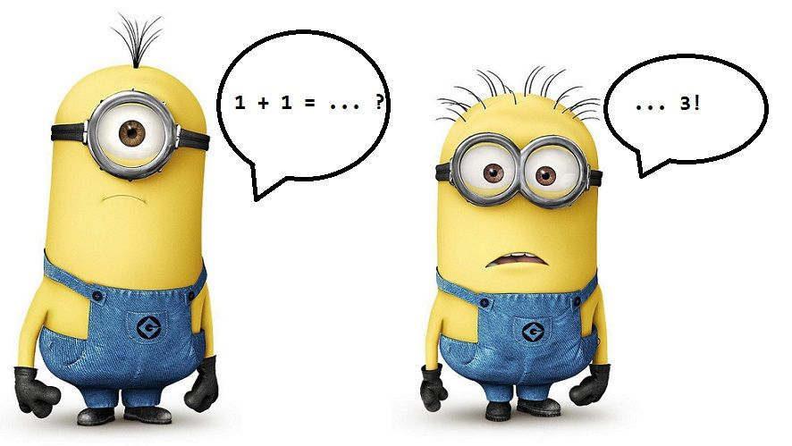

# EG25

Data de entrega: quinta, 25 nov 2021, 13:00
Arquivos requeridos: eg_soma3.py ([Baixar](https://edisciplinas.usp.br/mod/vpl/views/downloadrequiredfiles.php?id=3975118))
Tipo de trabalho: Trabalho individual

## Soma 3

<div style="text-align: center">
  
  <br>
  Fonte: Despicable me (<a href="https://www.pinterest.com/pin/392587292497809463/">Piterest</a>).
</div>

### Preparação padrão

Voltem a sala principal caso você esteja sozinhE.

Façam uma cópia do seu EI, colocando o prefixo eg\_. Alternativamente, há um arquivo com um esqueleto deste EG que pode ser baixado desta página. Este esqueleto contém funções totalmente feitas que usaremos nos experimentos.

Baixem daqui o programa experimento.py que usaremos para fazermos nossas análises experimentais das funções desenvolvidas .

Preencham o Formulário Individual conforme as instruções.

Escolham a pessoa estagiária e a pessoa gerente conforme as instruções.

Se tiverem alguma dúvida chamem o Hitoshi ou o Coelho. Eles devem estar passeando pelas salas, ou ter ido ao banheiro, ou foram tomar café.

---

### Testes do EI

Agora é aquele momento em que vocês testam em grupo o que fizeram no EI. No caso vocês precisam testar os métodos

- imprima_pares(self);
- imprima_trios(self); e
- monte_dicio_pos(self).

Todos são métodos da classe Soma3.

Usem para isso as coletâneas de testes que cada uma/um fez na função main().

Uma das pessoas do time pode agrupar e compartilhar com as demais todos os testes na main(). Assim, todas e todos poderão testar os seus trabalhos individuais.

Cada pessoa do time deve verificar os métodos do seu EI/EG estão dentro da especificação. Por exemplo, os métodos imprima_pares(), imprima_trios() e monte_dicio_pos() retornam None.

Não hesite em pedir ajuda a seu time em caso de dificuldades.

Caso algum problema seja encontrado, discuta com suas/seus colegas de time para resolvê-lo. Elas/eles ficarão muito felizes em lhe ajudar.

### 3SUM

O problema que trataremos neste EG é o seguinte.

Problema: dada uma lista de número inteiros distintos, determinar o número de trios que somam zero.

Por exemplo, para a lista [30, -30, -20, -10, 40, 0, 10, 15] temos que há 4 trios que somam zero:

     30  -30   0
     30  -20 -10
    -30  -10  40
    -10    0  10

+----+----+----+----+----+----+----+----+
| 30 |-30 |-20 |-10 | 40 | 0 | 10 | 15 |
+----+----+----+----+----+----+----+----+

Esta lista será repetidamente usada para exemplificarmos nossas ideias ao longo deste EG.

---

### Desafios

O desafio deste EG consiste em turbinar a classe Soma3 com os métodos:

- forca_bruta(seq): este é para vocês desenvolverem;
- busca_binaria(self): está prontinho no esqueleto eg_soma3.py;
- dicionarios(self): mais um método para vocês desenvolverem;
- misterio(self): outro método que está feitinho no esqueleto do EG.

Como temos feitos, faremos um discurso sobre cada método, um por vez, mesmo os que já estão completos no esqueleto do EG. Nesses discursos suporemos que s3 é um objeto Soma3, dt é um apelido para o atributo s3.data (list) e que pos é um apelido para o atributo s3.pos (dict).
Força bruta

Solução que testa todos os possíveis trios de números. Para fazer o método forca_bruta() busquem inspiração no método imprima_trios(). Assim, , então simplesmente testem se dt[i]+dt[j]+dt[k] == 0 para todos indices válidos i < j < k.

---

### Por exemplo

+----+----+----+----+----+----+----+----+
| 30 |-30 |-20 |-10 | 40 | 0 | 10 | 15 |
+----+----+----+----+----+----+----+----+
i j k

+----+----+----+----+----+----+----+----+
| 30 |-30 |-20 |-10 | 40 | 0 | 10 | 15 |
+----+----+----+----+----+----+----+----+
i j k

+----+----+----+----+----+----+----+----+
| 30 |-30 |-20 |-10 | 40 | 0 | 10 | 15 |
+----+----+----+----+----+----+----+----+
i j k

+----+----+----+----+----+----+----+----+
| 30 |-30 |-20 |-10 | 40 | 0 | 10 | 15 |
+----+----+----+----+----+----+----+----+
i j k

---

### Ordenação e busca binária

O método busca_binaria() está totalmente feito no esqueleto do EG. Vocês precisam apenas entender as ideias envolvidas no seu projeto, pois vão imitá-las no método dicionario().

A ideia deste método é a seguinte. Podemos enxergar a força bruta como uma solução que, para i < j, calcula o valor de dt[i]+dt[j] e procura na sublista dt[j+1: ] o valor -(dt[i]+dt[j]).

Espera ai! Hm, procura… procura… procura! Procura é o que o pessoal de computação chama de busca e isso lembra a tal busca binária que dizem que é muito eficiente. Hm, mas muita calma nessa hora. Para usarmos a busca binária o manual diz que a lista deve estar ordenada. Tudo bem! Inicialmente pegamos a lista:

+----+----+----+----+----+----+----+----+
| 30 |-30 |-20 |-10 | 40 | 0 | 10 | 15 |
+----+----+----+----+----+----+----+----+

e rearranjamos seu elementos de tal forma que fiquem crescentes como em

+----+----+----+----+----+----+----+----+
|-30 |-20 |-10 | 0 | 10 | 15 | 30 | 40 |
+----+----+----+----+----+----+----+----+

Agora podemos fazer mais ou menos a mesma coisa que a força bruta faz. Para todo par i < j calculamos dt[i]+d[j] e usamos busca binária para procurar -(dt[i]+d[j]) na lista dt[j+1: ]. Se encontramos uma posição de índice k com k > j tal que dt[k] == -(dt[i]+d[j]) isso significa que acabamos de achar um trio de soma zero novinho em folha! Por exemplo:

+----+----+----+----+----+----+----+----+
|-30 |-20 |-10 | 0 | 10 | 15 | 30 | 40 |
+----+----+----+----+----+----+----+----+
i j k

É essa ideia que o método busca_binaria() implementa. Para isso ele usa os serviços de

- list.sort() nativa do Python para ordenar dt e
- uma função index() para fazer a busca binária.

A função index() está feita no esqueleto do EG e usa bisect.bisect_left() do modulo Lib/bisect.py do Python

Será que todo esse trabalho de ordenar a lista e usar um negócio embaçado como busca binária vale a pena?

```
  def busca_binaria(self):
      '''(Soma3) -> int
      RECEBE um objeto Soma3 self.
      RETORNA o número de trios em self.data que somam zero.
      '''
      dt = self.data # apelido
      n = len(dt)
      conta = 0
      dt.sort()
      for i in range(n):
          for j in range(i+1, n):
              k = index(dt, -(dt[i] + dt[j]), j+1, n)
              if k != None: conta += 1
      return conta
```

---

### Dicionários

Agora vocês farão o método dicionario(), que seguirá os mesmos passos de busca_binaria(). Procurem ter isso em mente.
Preprocessar significa organizar as coisas sem nos preocuparmos em resolver diretamente o problema, mas é claro, tendo a esperança de que ao final esse trabalho terá valido a pena. Foi isso que ocorreu no heapsort() e também é feito na linha

                dt.sort()

do método busca_binaria(). Essa linha não procura trios de soma zero. Entretanto, esperamos, torcemos, para que ao final essa ordenação garanta que a contagem de trios de soma zero seja realizada mais rapidamente. Para utilizarmos pré-processamentos não podemos ser ansiosos.
A luz do que acabamos de discutir vamos sugerir agora um outro pré-processamento. Ainda olhando o código do método busca_binaria() vemos esse outro trecho:

```
                k = index(dt, -(dt[i] + dt[j]), j+1, n)
                if k != None: conta += 1
```

Esse trecho procura o valor -(dt[i] + dt[j]) na sublista dt[j+1: ]. Utilizaremos um dicionário nessa busca. Pré-processaremos a lista dt

+----+----+----+----+----+----+----+----+
| 30 |-30 |-20 |-10 | 40 | 0 | 10 | 15 |
+----+----+----+----+----+----+----+----+
0 1 2 3 4 5 6 7

e criarmos um dicionário em que as chaves são os elementos em dt e em que os valores são os índices das posições em que esses elementos estão. Este é o momento em que entra em campo o método monte_dicionario_pos()! Para a lista dt acima o dicionário pos é:

pos
+----+----+----+----+----+----+----+----+
| 30 |-30 |-20 |-10 | 40 | 0 | 10 | 15 | chave
+----+----+----+----+----+----+----+----+
| 0 | 1 | 2 | 3 | 4 | 5 | 6 | 7 | valor
+----+----+----+----+----+----+----+----+

Nesse caso temos que pos[30] é 0, pos[-30] é 1, pos[-20] é 2, …

Agora, suponha que queremos saber se para i < j, o valor val = -(dt[i] + dt[j]) está em alguma posição k da lista dt com k > j. Para isso podemos verificar se val está no dicionário e se k = pos[val] para k > j. A condição k > j, como nos métodos forca_bruta() e busca_binaria(), garante que esse seja um novo trio de soma zero e já não tenha sido contabilizado.

Por exemplo, para i = 1 e j = 3 temos que val = -(dt[i]+dt[j]) = 40 e que k = pos[40] = 4. Logo, dt[i], dt[j], dt[k] é um trio de soma zero.

Isso já é o suficiente para vocês se embrenharem pelo meio da mata e desenvolver o método dicionario(). Hm, será que toda essa trabalheira e confusão vale a pena?

---

### Mistério

Recebemos pelas redes sociais o método misterio() que está logo a seguir. Simplesmente copiamos e colamos na classe Soma3 em eg_soma3.py. O método parece meio complicado, confuso,… Não temos a menor ideia se funciona. Se funciona não sabemos a razão e nem se é eficiente. Só recebemos e estamos passando para frente sem nos questionarmos, como costuma ocorrer nas redes sociais.

Será que funciona? Se funciona é eficiente? Tudo é uma questão de opinião, não de fatos ou evidências? Vejam o que vocês descobrem.

```
    def misterio(self):
        '''(Soma3) -> int
        RECEBE um objeto Soma3 self.
        RETORNA o número de trios em self.data que somam zero.
        '''
        dt = self.data
        n = len(dt)
        conta = 0
        dt.sort()
        for i in range(n-2):
            x = dt[i]
            e = i+1
            d = n-1
            while e < d:
                y = dt[e]
                z = dt[d]
                soma = x + y + z
                if soma == 0:
                    conta += 1
                    e += 1
                    d -= 1
                elif soma > 0: d -= 1
                else: e += 1
        return conta
```

---

### De experimentos a …

Baixem o arquivo [experimento.py](https://colab.research.google.com/drive/1KNd71KVhhDCIKqBDy-iKrr460t8IDGvG?usp=sharing). Este arquivo fará experimentos com os métodos:

- forca_bruta(), que vocês fizeram
- busca_binaria(), que está feito no esqueleto do EG
- dicionario(), que vocês fizeram
- misterio() , que passaram para nós e colocamos uma cópia no esqueleto do EG

Baseados nesses experimentos, qual o consumo de tempo assintótico desses métodos? Agora, a pergunta que não quer calar… será que não quer mesmo?!

**Pergunta**: Quanto tempo vocês estimam que cada um desses métodos gastará para determinar o número de trios somam zero em uma lista com 218 = 262144 elementos?

Procure responder em unidades como segundos, ou minutos, ou horas, ou dias, ou anos, …

---

### Lições

Chegou o momento de abrirmos a caixa de ferramentas que andamos montando ao longo do ano e resolvermos alguns problemas. As ferramentas que usamos hoje foram ordenação, busca binária, dicionários, pré-processamento,…, esquecemos alguma?

Os método forca_bruta(), busca_binaria() e dicionario() tem uma mesma estrutura, com a diferença que no coração de

- forca_bruta() pulsa a busca sequencial;
- busca_binaria corre o sangue da busca binária; e
- dicionario() a frequência é a dos dicionários.

Ideias? Comentários? Perguntas?

---

### Para conseguir um bônus …

Nesta altura do campeonato todo mundo já sabe …

Para entregar o EG não é necessário modificar o cabeçalho do seu EI. Você pode fazer as modificações que desejar no código do EI, seguindo ou não as discussões do time.

Você precisa entregar o arquivo com extensão eg\_ contendo os a classe Soma3 do EI com a main(). Os novos métodos e/ou funções implementados podem ser incluídos e têm sido bônus do bônus.

Você também precisa responder o formulário individual cujo link está no início deste EG.

Teste a solução antes de entregá-la.

O bônus recebido será 10% da nota do seu EG.

Não serão aceitos EGs após encerrado o prazo de entrega.

---

### Arquivos requeridos

##### eg_soma3.py

```
# -*- coding: utf-8 -*-

#------------------------------------------------------------------
# LEIA E PREENCHA O CABEÇALHO
#------------------------------------------------------------------

'''

    Nome:
    NUSP:

    Ao preencher esse cabeçalho com o meu nome e o meu número USP,
    declaro que todas as partes originais desse exercício programa
    foram desenvolvidas e implementadas por mim e que, portanto, não
    constituem desonestidade acadêmica ou plágio.

    Entendo que trabalhos sem assinatura devem receber nota zero e, ainda
    assim, poderão ser punidos por desonestidade acadêmica.
    Declaro também que sou responsável por todas as cópias desse
    programa e que não distribui ou facilitei a sua distribuição.

    Estou ciente que os casos de plágio e desonestidade acadêmica
    estarão sujeitos às penalidades descritas na página da disciplina
    na seção "Sobre colaboração em MAC0122".

    Reconheço que utilizei as seguintes fontes externas ao conteúdo
    utilizado e recomendado em MAC0122, ou recebi auxílio das pessoas
    listadas abaixo.

    - LISTA de fontes externas utilizadas (links ou referências como livros)
        -

    - LISTA das pessoas que me auxiliaram a fazer esse trabalho
        -
'''

# https://docs.python.org/3/library/bisect.html
from bisect import bisect_left

## ==================================================================
#
def main():
    '''
    Testes da classe Soma 3

    inclua mais 10 testes usando listas diferentes. Por exemplo,
    o que deve acontecer com listas vazias, listas com números negativos,
    listas ordenadas, etc.
    '''
    print("Testes do EI25 - Soma3")

    testes = [
        [44, 11, 77, 33]
    ]

    for t in testes:

        s3 = Soma3(t)
        print(f"\nCriação usando a lista:\nent : {t}")
        print(f"{s3}")

        print("\nDicionário de posições:")
        s3.monte_dicio_pos()
        print(f"{s3}")

        print("\nPares")
        s3.imprima_pares()

        print("\nTrios")
        s3.imprima_trios()

#---------------------------------------------------------
# Função auxiliar
def index(a, x, e, d):
    '''(list, obj, int, int) -> int ou None
    RECEBE uma lista a um objeto x e dois inteiros lo e hi.
    RETORNA um índice i, e <= i < d, tal que a[i]==x
        ou retorna None se um tal índice não existe.
    NOTA: o consumo de tempo da função é O(lg n) em que
        n = d-e. Ver https://docs.python.org/3/library/bisect.html
    '''
    i = bisect_left(a, x, e, d)
    if i != len(a) and a[i] == x: return i
    return None # raise ValueError

# ===================================================================

class Soma3:
    def __init__(self, seq):
        ''' (Soma3, list) -> None
        '''
        self.data = seq  # faz referência, não copia.
        self.pos = {}

    # -------------------------------------------------------------------
    def __str__(self):
        ''' (Soma3) -> None
        '''
        return f'data: {self.data}\npos : {self.pos}\n'

    # -------------------------------------------------------------------
    def imprima_pares(self):
        ''' (Soma3) -> None
        IMPRIME todos os pares da lista self.data.

        EXEMPLO: para self.data = [44, 11, 77, 88]
        o método deve imprimir:
        44  11
        44  77
        44  88
        11  77
        11  88
        77  88
        '''
        # escreva sua solução
        return None

    # -------------------------------------------------------------------
    def imprima_trios(self):
        ''' (Soma3) -> None
        IMPRIME todos os trios da lista self.data.

        EXEMPLO: para self.data = [44, 11, 77, 88]
        o método deve imprimir:
        44  11  77
        44  11  88
        44  77  88
        11  77  88
        '''
        # escreva sua solução
        return None

    # -------------------------------------------------------------------
    def monte_dicio_pos(self):
        ''' (Soma3) -> None
        MONTA o dicionário self.pos a partir do conteúdo em self.data.
        Usando cada elemento de self.data como chave, self.pos armazena
        o índice desse elemento na lista self.data.

        EXEMPLO: para self.data = [44, 11, 77, 88]
        então self.pos deve conter {44:0, 11:1, 77:2, 88:3}
        '''
        # escreva sua solução
        return None

    #---------------------------------------------------------
    def forca_bruta(self):
        '''(Soma3) -> int
        RECEBE um objeto Soma3 self.
        RETORNA o número de trios em self.data que somam zero.

        Para projetar este método procure seguir as recomendações
            do EG.

        EXEMPLOS

        In [17]: v = [30, -30, -20]
        In [18]: t = Soma3(v)
        In [19]: t.forca_bruta()
        Out[19]: 0

        In [20]: v = [30, -30, -20, -10]
        In [21]: t = Soma3(v)
        In [22]: t.forca_bruta()
        Out[22]: 1

        In [23]: v = [30, -30, -20, -10, 40]
        In [24]: t = Soma3(v)
        In [25]: t.forca_bruta()
        Out[25]: 2

        In [26]: v = [30, -30, -20, -10, 40, 0]
        In [27]: t = Soma3(v)
        In [28]: t.forca_bruta()
        Out[28]: 3

        In [29]: v = [30, -30, -20, -10, 40, 0, 10]
        In [30]: t = Soma3(v)
        In [31]: t.forca_bruta()
        Out[31]: 4

        In [32]: v = [30, -30, -20, -10, 40, 0, 10, 15]
        In [33]: t = Soma3(v)
        In [34]: t.forca_bruta()
        Out[34]: 4
        '''
        # escreva sua solução
        return 0

    #---------------------------------------------------------
    def busca_binaria(self):
        '''(Soma3) -> int
        RECEBE um objeto Soma3 self.
        RETORNA o número de trios em self.data que somam zero.

        EXEMPLOS

        In [35]: v = [30, -30, -20]
        In [36]: t = Soma3(v)
        In [37]: t.busca_binaria()
        Out[37]: 0

        In [38]: v = [30, -30, -20, -10]
        In [39]: t = Soma3(v)
        In [40]: t.busca_binaria()
        Out[40]: 1

        In [41]: v = [30, -30, -20, -10, 40]
        In [42]: t = Soma3(v)
        In [43]: t.busca_binaria()
        Out[43]: 2

        In [44]: v = [30, -30, -20, -10, 40, 0]
        In [45]: t = Soma3(v)
        In [46]: t.busca_binaria()
        Out[46]: 3

        In [47]: v = [30, -30, -20, -10, 40, 0, 10]
        In [48]: t = Soma3(v)
        In [49]: t.busca_binaria()
        Out[49]: 4

        In [50]: v = [30, -30, -20, -10, 40, 0, 10, 15]
        In [51]: t = Soma3(v)
        In [52]: t.busca_binaria()
        Out[52]: 4
        '''
        dt = self.data # apelido
        n = len(dt)
        conta = 0
        dt.sort()
        for i in range(n):
            for j in range(i+1, n):
                k = index(dt, -(dt[i] + dt[j]), j+1, n)
                if k != None: conta += 1
        return conta

    #---------------------------------------------------------
    def dicionario(self):
        '''(Soma3) -> int
        RECEBE um objeto Soma3 self.
        RETORNA o número de trios em self.data que somam zero.

        Para projetar este método procure seguir as recomendações
            do EG.

        EXEMPLOS

        In [2]: v = [30, -30, -20]
        In [3]: t = Soma3(v)
        In [4]: t.dicionario()
        Out[4]: 0

        In [5]: v = [30, -30, -20, -10]
        In [6]: t = Soma3(v)
        In [7]: t.dicionario()
        Out[7]: 1

        In [8]: v = [30, -30, -20, -10, 40]
        In [9]: t = Soma3(v)
        In [10]: t.dicionario()
        Out[10]: 2

        In [11]: v = [30, -30, -20, -10, 40, 0]
        In [12]: t = Soma3(v)
        In [13]: t.dicionario()
        Out[13]: 3

        In [14]: v = [30, -30, -20, -10, 40, 0, 10]
        In [15]: t = Soma3(v)
        In [16]: t.dicionario()
        Out[16]: 4

        In [17]: v = [30, -30, -20, -10, 40, 0, 10, 15]
        In [18]: t = Soma3(v)
        In [19]: t.dicionario()
        Out[19]: 4
        '''
        # escreva sua solução
        return 0

    #---------------------------------------------------------
    def misterio(self):
        '''(Soma3) -> int
        RECEBE um objeto Soma3 self.
        RETORNA o número de trios em self.data que somam zero.
        '''
        dt = self.data
        n = len(dt)
        conta = 0
        dt.sort()
        for i in range(n-2):
            x = dt[i]
            e = i+1
            d = n-1
            while e < d:
                y = dt[e]
                z = dt[d]
                soma = x + y + z
                if soma == 0:
                    conta += 1
                    e += 1
                    d -= 1
                elif soma > 0: d -= 1
                else: e += 1
        return conta

# ===================================================================

if __name__ == '__main__':
    main()
```
