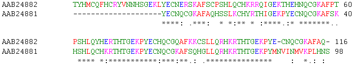

# EI26

Data de entrega: segunda, 29 nov 2021, 22:00
Arquivos requeridos: lcs.py ([Baixar](https://edisciplinas.usp.br/mod/vpl/views/downloadrequiredfiles.php?id=3974821))
Tipo de trabalho: Trabalho individual

## LCS

### Objetivos

Nessa atividade vamos estudar um problema relacionado à comparação de strings que possui soluções com consumos de tempo muito diferentes. Vamos continuar a treinar a análise de algoritmos para estudar o comportamento dessas soluções e apresentar algoritmos mais eficientes baseados nas técnicas de memoização e programação dinâmica.

### Introdução

Encontrar uma Maior Subsequência Comum (LCS - longest common subsequence) entre duas strings é um problema clássico da ciência da computação e suas soluções formam a base de programas de comparação de dados como o diff, com aplicações em linguística computacional e bioinformática, dentre outras. Por exemplo, sequências de DNA podem ser representadas por sequências formadas pelas bases ‘ACGT’ (cada uma das 4 letras representa uma base: adenina, citosina, guanina e timina). O LCS pode ser usado para encontrar dois DNAs que possuem a maior subsequência de bases em comum, semelhante ao que o pessoal de MAC0110 fez nos EPs de alinhamentos globais ótimos no primeiro semestre.

<div style="text-align: center; font-size: 12px; margin: 0 8% 0 8%;">
  
  <br>
  Figura: Alinhamento entre duas sequências, produzido pelo programa <a href="https://pt.wikipedia.org/wiki/Clustal">ClustalW</a> entre duas proteínas <a href="https://pt.wikipedia.org/wiki/Dedo_de_zinco">dedo-de-zinco humanas</a> (human zinc finger proteins) identificadas por seus números de acesso no <a href="https://pt.wikipedia.org/wiki/GenBank">GenBank</a>.
Fonte: <a href="https://pt.wikipedia.org/wiki/Alinhamento_de_sequ%C3%AAncias">Wikipédia: Alinhamento de sequências</a>
</div>

Note que encontrar uma LCS é diferente de encontrar uma maior substring comum. Uma substring comum deve ser formada por símbolos consecutivas das sequências originais.

---

### Subsequências

De forma mais formal, uma subsequência é uma sequência que aparece na mesma ordem relativa, mas não é necessariamente contígua.

Exemplos:

- "abc" é subsequência de "abcdefg".
- "abg" é subsequência de "abcdefg".
- "bdf" é subsequência de "abcdefg".
- "aeg" é subsequência de "abcdefg".
- "acefg" é subsequência de "abcdefg".
- "gef" NÃO é subsequência de "abcdefg".

```
    +---+---+---+                       +---+---+---+                      +---+---+---+
    | a | e | g |                       | b | d | f |                      | g | e | g |
    +---+---+---+                       +---+---+---+                      +---+---+---+

    +---+---+---+---+---+---+---+       +---+---+---+---+---+---+---+      +---+---+---+---+---+---+---+
    | a | b | a | d | e | f | g |       | a | b | a | d | e | f | g |      | a | b | c | d | e | f | g |
    +---+---+---+---+---+---+---+       +---+---+---+---+---+---+---+      +---+---+---+---+---+---+---+
```

---

### Maior subsequência comum

O atriz do show será o seguinte problema.

Problema LCS: dadas duas strings s e t, encontrar uma maior subsequência comum entre s e t.

Já vimos que uma subsequência é uma sequência que aparece na mesma ordem relativa, mas não é necessariamente contígua. Por exemplo, "abc", "abg", "bdf", "aeg", "acefg" etc. são subsequências de "abcdefg".

Exemplos:

- a LCS para as sequências "ABCDGH" e "AEDFHR" é "ADH", com comprimento 3.
- a LCS para as sequências "AGGTAB" e "GXTXAYB" é "GTAB", com comprimento 4.

```
    +---+---+---+---+---+---+       +---+---+---+---+---+---+
 s  | A | B | C | D | G | H |    s  | A | G | G | T | A | B |
    +---+---+---+---+---+---+       +---+---+---+---+---+---+


    +---+---+---+---+---+---+       +---+---+---+---+---+---+---+
 t  | A | E | D | F | H | R |    t  | G | X | T | X | A | Y | B |
    +---+---+---+---+---+---+       +---+---+---+---+---+---+---+

```

---

### Ideias …

Uma primeira ideia é gerar todas as subsequências de cada sequência, comparar todas e encontrar a subsequência mais longa.

Um string de comprimento n tem 2n subsequências diferentes possíveis. Com tantas alternativas, essa não parece ser uma solução prática.

Ao invés disso, vamos tentar parear um elemento de s com um elemento de t de cada vez. E vamos tentar fazer isso da direita para a esquerda, ou seja, começando pelo caractere de maior índice na string.

Observe o seguinte exemplo, para s = "AGGCCTAGB" e t = "GTXAYB" temos uma lcs = "GTAB" de comprimento 4 com o possível pareamento:

```
    s =    A   G   G  C  C  T     A  G  B
                   |        |     |     |
    t =            G        T  X  A  Y  B
```

Agora suponha que um passarinho mágico nos deu uma string r que é lcs de s e t. Sim, esse negócio é estranho… Queremos encontrar essa tal string r e alguém nós diz que um passarinho mágico nos deu r… Fala sério! Bem, assim mesmo, continuemos e vejamos o que r tem a contar sobre si mesma.

Voltando… Suponha ainda que r, s e t têm comprimentos k, m e n, respectivamente. Então podemos fazer as seguintes observações sobre a cara de r:

- se s[m-1] == t[n-1], então r[0:k-1] é lcs de s[0:m-1] e t[0:n-1].

```
                                  m
        +---+---+---+---+---+---+
     s  | ? | ? | ? | ? | ? | A |
        +---+---+---+---+---+---+
                                      n
        +---+---+---+---+---+---+---+
     t  | ? | ? | ? | ? | ? | ? | A |
        +---+---+---+---+---+---+---+
                          k
        +---+---+---+---+
     r  | ? | ? | ? | A |
        +---+---+---+---+

```

- se s[m-1] != t[n-1] e r[k-1] != s[m-1], então r é lcs de s[0:m-1] e t.

```
                                  m
        +---+---+---+---+---+---+
     s  | ? | ? | ? | ? | ? | A |
        +---+---+---+---+---+---+
                                      n
        +---+---+---+---+---+---+---+
     t  | ? | ? | ? | ? | ? | ? | B |
        +---+---+---+---+---+---+---+
                          k
        +---+---+---+---+
     r  | ? | ? | ? | *----> diferente se A, pode ser B ou não...
        +---+---+---+---+

```

- se s[m-1] != t[n-1] e r[k-1] != t[n-1], então r é lcs de s e t[0:n-1].

```
                                  m
        +---+---+---+---+---+---+
     s  | ? | ? | ? | ? | ? | A |
        +---+---+---+---+---+---+
                                      n
        +---+---+---+---+---+---+---+
     t  | ? | ? | ? | ? | ? | ? | B |
        +---+---+---+---+---+---+---+
                          k
        +---+---+---+---+
     r  | ? | ? | ? | *----> diferente de B, pode ser A ou não...
        +---+---+---+---+

```

Baseado na nossa entrevista com a string r, podemos, depois de pensar bastante e rever as anotações das reuniões sobre recursão, construir nossa primeiro função para o problema LCS.

```
def lcsR(s, m, t, n):
  '''(str, int, str, int) -> str
    RECEBE uma string s, um inteiro m, uma string t e um inteiro n.
    RETORNA uma LCS de s[0:m] e t[0:n].
  ''' # BASE
if m == 0 or n == 0: return ""

    # REDUZ
    if s[m-1] == t[n-1]:
        return lcsR(s, m-1, t, n-1) + s[m-1]

    # REDUZ
    lcs_1 = lcsR(s, m-1, t,   n)
    lcs_2 = lcsR(s,   m, t, n-1)

    # COMBINA
    if len(lcs_1) > len(lcs_2): return lcs_1
    return lcs_2
```

---

### Consumo de tempo

Seja T(m, n) o número máximo de comparações feitas pela função lcsR(s, m, t, n). Olhando o código, mais ou menos rapidamente, vemos que:

- T(m, 0) = 0
- T(0, n) = 0
- T(m, n) = T(m − 1, n) + T(m, n − 1) + 1, para m, n > 0.

Para entender melhor essa fórmula, observe (desenhe!) a árvore criada pela expansão de T(m − 1, n) e T(m, n − 1). Essa conta meio estranha, junto com uns desenhos de árvores de recursão, sugere que o consumo de tempo de lscR() é possivelmente exponencial. Será que é isso mesmo?

---

### O que vocês devem fazer

Agora sim! Para aquecer os motores para a próxima reunião… neste EI vocês deverão fazer uma função subseq() que resolve o problema a seguir.

**Problema:\*** dadas duas strings s e t, decidir se s é subsequência de t.

A especificação da função está no esqueleto lcs.py deste EI.

Teste sua função usando várias strings diferentes na função main().

---

### Roteiro

- Baixe o arquivo lcs.py para uma pasta do seu computador.
- Carregue esse arquivo usando o Spyder ou Colab ou seu IDE Python predileto.
- Leia o cabeçalho do arquivo com atenção e edite o cabeçalho colocando seu nome e NUSP.
- Estude o conteúdo do arquivo, esse enunciado e os exemplos fornecidos para entender o que você deve implementar.
- Implemente, documente e teste seu trabalho.
- Submeta apenas o arquivo lcs.py.

---

###- Honestidade acadêmica

Esse é um exercício individual, não em grupo. Isso não significa que você não pode receber ajuda de outras pessoas, inclusive de seus colegas. De uma forma geral, gostaríamos de incentivar as discussões de ideias, conceitos e alternativas de solução. Nossa maior recomendação é evitar olhar o código fonte de uma solução antes de escrever o seu programa. Em caso de dúvida, consulte a página Sobre colaboração em MAC0122

De forma sucinta, evite as seguintes ações que caracterizam desonestidade acadêmica na realização dos trabalhos individuais desse curso:

- buscar e obter uma solução (parcial ou completa, correta ou não) de exercício programa (EP) na internet ou qualquer outro meio físico ou virtual, durante o período de submissão do referido EP;
- solicitar ou obter uma cópia (parcial ou completa, correta ou não) da solução de um EP durante o seu período de submissão;
- permitir que um colega acesse uma cópia (parcial ou completa, correta ou não) do seu EP, durante o período de submissão;
- ainda mais grave é o plágio, que se configura pela utilização de qualquer material não visto em aula ou não descrito no enunciado, que não seja de sua autoria, em parte ou ao todo, e entregar, com ou sem edição, como se fosse seu trabalho, para ser avaliado.

---

### Arquivos requeridos

##### lcs.py

```
# -*- coding: utf-8 -*-

#------------------------------------------------------------------
# LEIA E PREENCHA O CABEÇALHO
#------------------------------------------------------------------

'''

    Nome:
    NUSP:

    Ao preencher esse cabeçalho com o meu nome e o meu número USP,
    declaro que todas as partes originais desse exercício programa
    foram desenvolvidas e implementadas por mim e que, portanto, não
    constituem desonestidade acadêmica ou plágio.

    Entendo que trabalhos sem assinatura devem receber nota zero e, ainda
    assim, poderão ser punidos por desonestidade acadêmica.
    Declaro também que sou responsável por todas as cópias desse
    programa e que não distribui ou facilitei a sua distribuição.

    Estou ciente que os casos de plágio e desonestidade acadêmica
    estarão sujeitos às penalidades descritas na página da disciplina
    na seção "Sobre colaboração em MAC0122".

    Reconheço que utilizei as seguintes fontes externas ao conteúdo
    utilizado e recomendado em MAC0122, ou recebi auxílio das pessoas
    listadas abaixo.

    - LISTA de fontes externas utilizadas (links ou referências como livros)
        -

    - LISTA das pessoas que me auxiliaram a fazer esse trabalho
        -
'''

#------------------------------------------------------
def main():
    '''
    Testes para os algoritmos de LCS

    Inclua ao menos 10 testes distintos para sua função subseq().
    '''
    print("Testes para sua função subseq()")
    print("--------------------------------\n")

    print("Exemplos de execuções de lcs_rec()")
    print("----------------------------------")
    print("teste 0:")
    s = 'abracadabra'
    t = 'yabbadabbadoo'
    print(f"s={s}\nt={t}\nLCS(s,t)={lcs_rec(s,t)}\n-----")
    print("teste 1:")
    s = 'tagctgaatc'
    t = 'tatactgcctt'
    print(f"s={s}\nt={t}\nLCS(s,t)={lcs_rec(s,t)}\n-----")
    print("teste 2:")
    s = 'caattttataccgcagc'
    t = 'gaataggtatcgcca'
    print(f"s={s}\nt={t}\nLCS(s,t)={lcs_rec(s,t)}\n-----")
    print("teste 3:")
    s = 'taggcagggcacgccaccttatg'
    t = 'tccgtttctaaaccatacaaacctcct'
    print(f"s={s}\nt={t}\nLCS(s,t)={lcs_rec(s,t)}\n-----")
    print("teste 4:")
    s = 'gaaccgcaggaattttcgcttgatccaacgaacca'
    t = 'ggtatacggggctttctagaccaaggaaaat'
    print(f"s={s}\nt={t}\nLCS(s,t)={lcs_rec(s,t)}\n-----")
    print("teste 5:")
    s = 'tctgggaatgcggtctcgcttagctgcggggacgacgagcagtgaacgacgcttcccacgc'
    t = 'ttatggctcactaccacggccaaagaggtagagcacattttctacccaggctgaggtgtcctcttaccttt'
    print(f"s={s}\nt={t}\nLCS(s,t)={lcs_rec(s,t)}\n-----")

#----------------------------------------------
def subseq (s, t):
    ''' (str, str) -> bool
    RECEBE strings s e t.
    RETORNA True se s é subsequência de t.
    '''
    # escreva sua solução

#----------------------------------------------
def lcs_rec(s, t):
    '''(str, str) -> str
    INTERFACE para a função recursiva lcs_rec.
    '''
    m = len(s)
    n = len(t)
    return lcsR(s, m, t, n)

#----------------------------------------------
def lcsR(s, m, t, n):
    '''(str, int, str, int) -> str
    RECEBE uma string s, um inteiro m, uma string t e um inteiro n.
    RETORNA uma LCS de s[0:m] e t[0:n].
    '''
    # BASE
    if m == 0 or n == 0: return ""

    # REDUZ
    if s[m-1] == t[n-1]:
        return lcsR(s, m-1, t, n-1) + s[m-1]

    # REDUZ
    lcs_1 = lcsR(s, m-1, t,   n)
    lcs_2 = lcsR(s,   m, t, n-1)

    # COMBINA
    if len(lcs_1) > len(lcs_2): return lcs_1
    return lcs_2

#----------------------------------------------------
if __name__ == "__main__":
    main()

```
